# 如何在 Word 中插入一行

> 原文:[https://www.javatpoint.com/how-to-insert-a-line-in-word](https://www.javatpoint.com/how-to-insert-a-line-in-word)

线条是 Word 中的基本设计元素。它有助于我们提高文档的可读性。在微软 Word 中，我们可以插入两种类型的行。

## 1.水平线

横线也叫**横线**。这些行帮助我们分隔文本的各个部分。

在[字](https://www.javatpoint.com/ms-word-tutorial)中插入横线有以下几种方法。

### 方法 1:使用形状选项卡

“形状”选项卡包含各种线条选项，包括箭头线、直线等。

**第一步:**打开 Word 文档，将光标放在文档中要插入行的位置。

**步骤 2:** 单击功能区中的**插入选项卡**，并从**插图**部分选择**形状**。

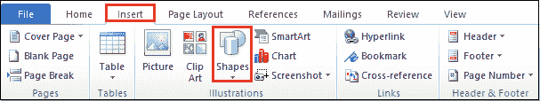

**第三步:**一旦我们点击了形状，屏幕上就会出现形状菜单。

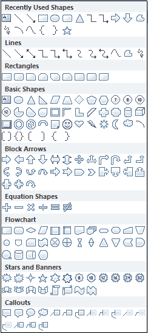

**第四步:**选择要插入的线条，按住该线条，并将其拖动到所选位置。

下面的截图显示该行被插入到 Word 文档中。

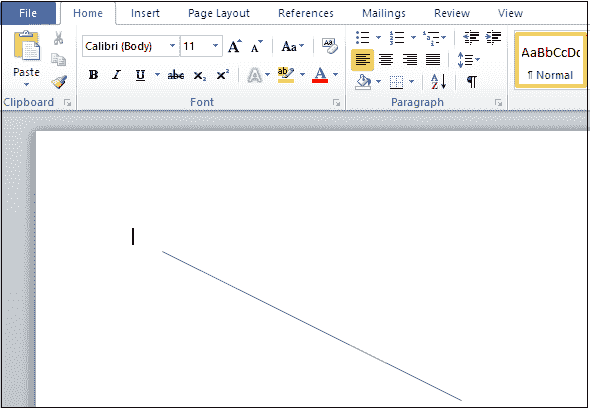

### 方法 2:使用 Shift +破折号(“-”)键

shift+破折号(-)键是插入**粗线**最简单的方法。**信函、页面标题、简历、项目报告、表格等文档中常用的加粗行**。插入粗线的主要目的是使我们的文档保持良好和好看。

按照以下步骤使用 Shift+破折号(“-”)键插入一条粗线。

**第 1 步:**转到要添加粗体行的 Word 文档。

**第二步:**按下**【回车键】**在文字和线条之间留出空间。

**第三步:**按住**换挡和破折号(“-”)键**。一旦在页面上画线，按下**“回车键”**可以看到 Word 在页面上自动生成加粗的一行。

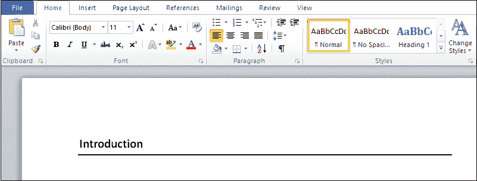

### 方法 3:从键盘输入几个字符(-、===、___、***、##、~~~)

在 Microsoft Word 中，您可以使用以下简单步骤插入各种不同类型的行。

**第一步:**打开 Word 文档，将光标放在要插入行的位置。

**第二步**:输入下面列出的字符，按回车键。

*   **连字符**

要插入一条普通线，**键入三个连续的连字符(- )** 并按下**回车键**。下面的截图显示屏幕上出现了一条白线。

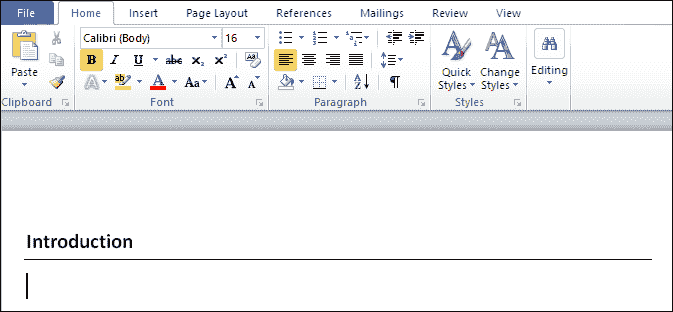

*   要插入双实线，**输入三个连续的等号(===)** 并按下**回车键**。

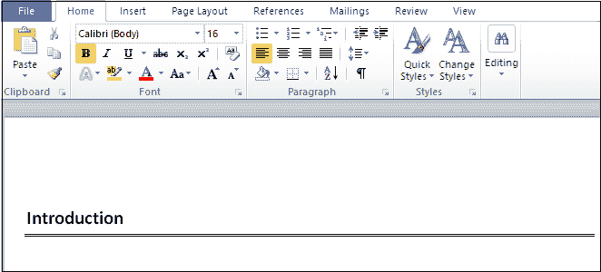

*   要插入粗线，**输入三个连续的下划线(___)** 并按下**回车键**。

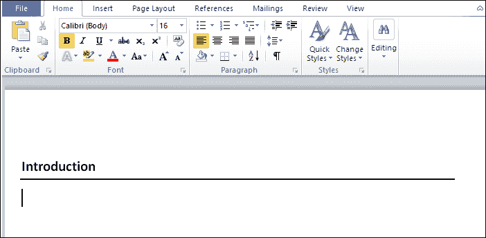

*   要插入虚线或虚线，**输入三个连续的星号(***)** 并按下**回车键**。

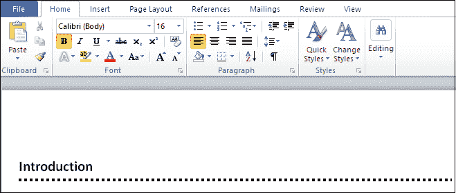

*   要插入一条中心粗的三线，**输入三个连续的数字符号(##)** ，按**回车键**。

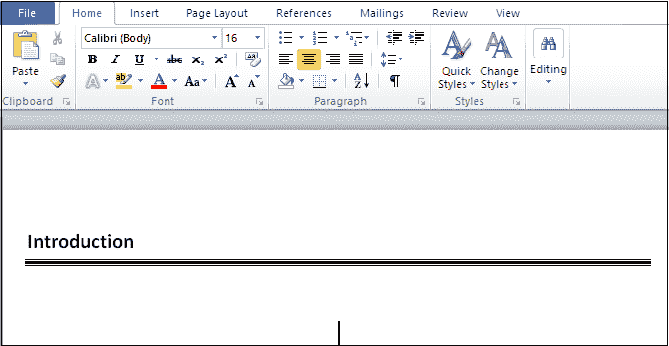

*   要插入波浪线，**输入三个连续波浪线(~~~)** ，按**回车键**。

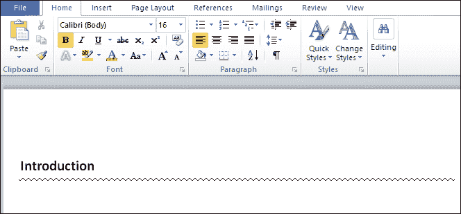

### 方法 4:使用功能区中的边框

使用边框插入线条有以下步骤-

**第一步:**打开 word 文档，将光标放在要插入行的文档上。

**第二步:**转到**主页**选项卡，点击**段落部分**中的**下边框**选项。

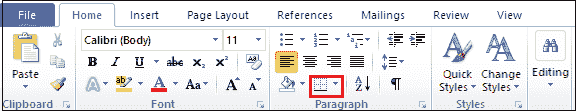

**第三步:**点击**横线**屏幕出现如下菜单。

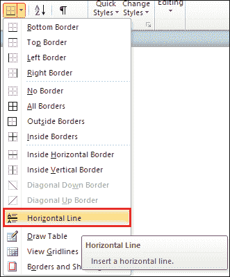

**第四步:**屏幕上出现一条横线。如果要更改**的高度、宽度、颜色和对齐方式，**则双击该行。弹出**格式横线**窗口。根据您的要求排列高度、宽度、颜色和对齐方式，点击**确定**。

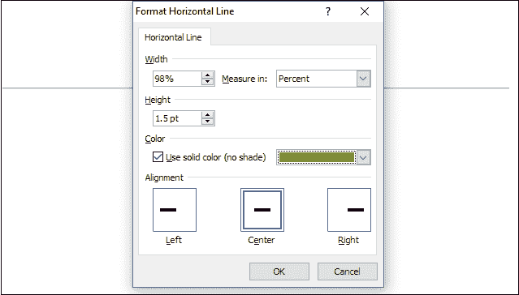

屏幕上出现以下一行。

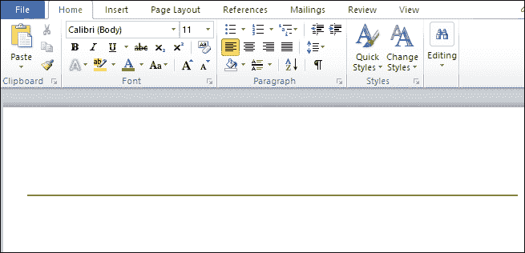

## 2.垂直线

垂直线用于分隔 word 文档中的文本列。

在 word 文档中插入垂直线有以下几种方法-

### 方法 1:使用页面布局

**第一步:**打开想要插入竖线的 word 文档。

**第二步:**选择文档，如下图截图所示。

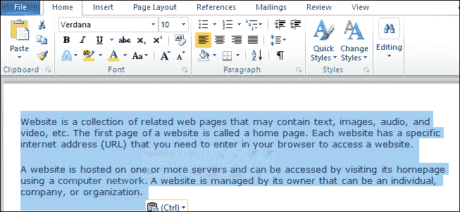

**第三步:**点击屏幕顶部的**页面布局**，从页面设置部分选择**栏**。

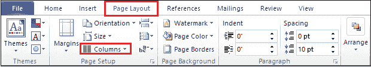

**第 4 步:**屏幕出现以下栏目菜单，点击**更多栏目**。

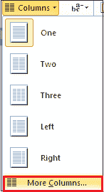

**第 4 步:**将出现列窗口。选择要添加的**列数**，勾选之间的**线复选框，然后点击**确定**。**

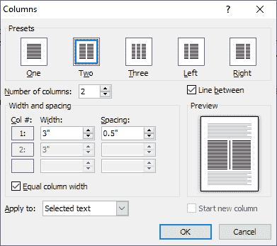

下面的截图显示页面被分成两列。

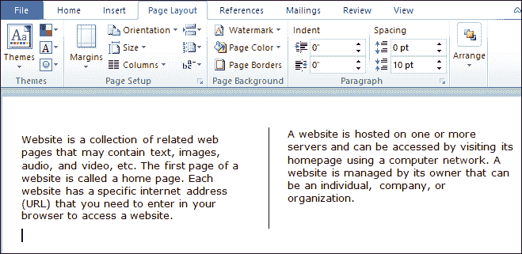

### 方法 2:使用形状选项卡

**第一步:**打开 Word 文档，将光标放在要插入行的文档上。

**第二步:**点击**插入**并从**插图部分选择**形状**。**

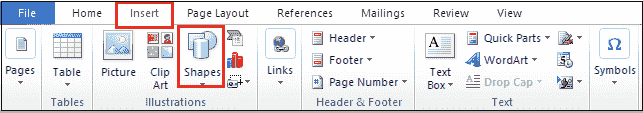

**步骤 3:** 屏幕上出现形状窗口。根据您的要求选择形状，并将其绘制在 Word 文档上。

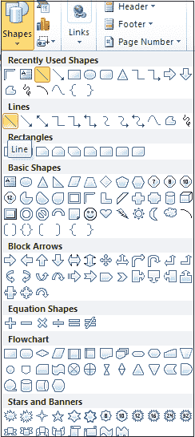

下面的屏幕截图显示该行被添加到 Word 文档中。

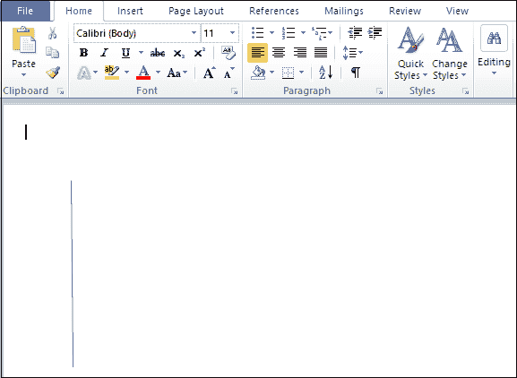

### 方法 3:使用边框底部

**第一步:**转到**主页**选项卡，点击**段落部分**中的**下边框**图标。

**步骤 2:** 屏幕上出现以下窗口，其中包含边框列表。点击**左边框**。

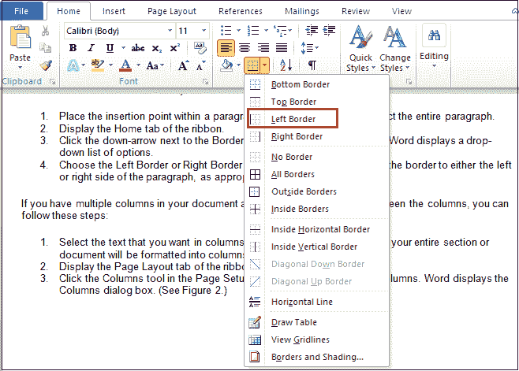

下面的截图显示了在 Word 文档上添加了左侧垂直边框。

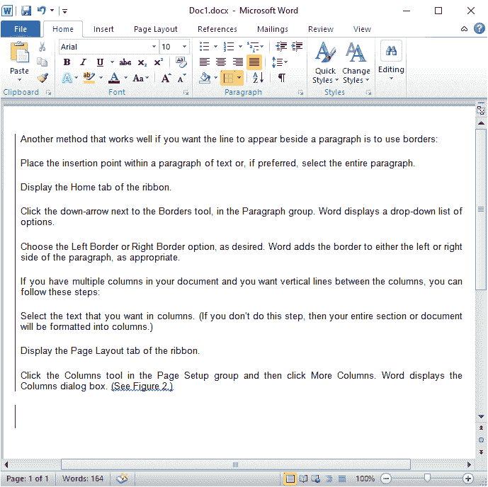

* * *