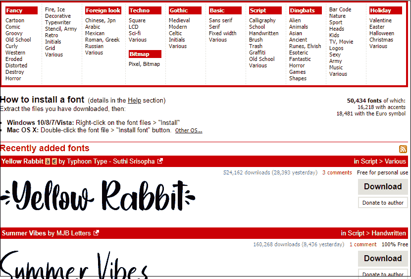
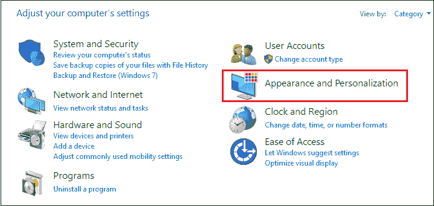
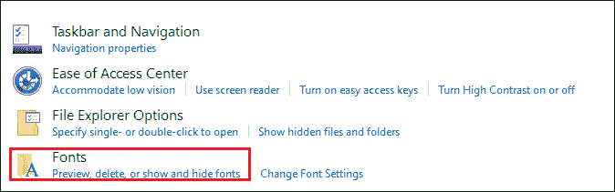
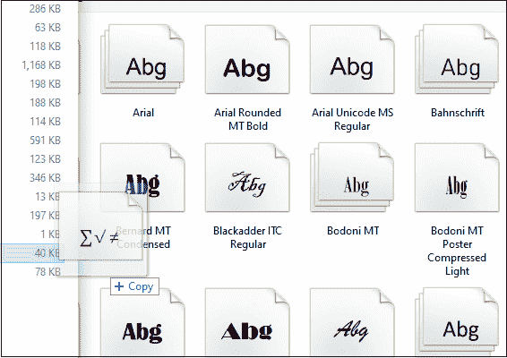
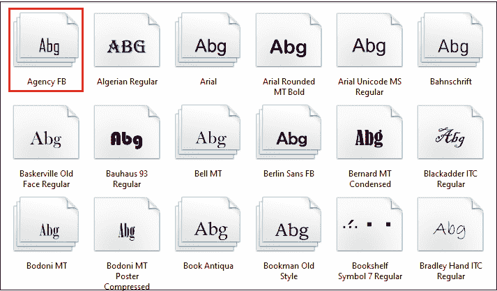
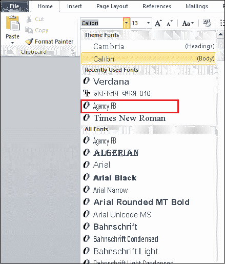

# 如何在 Microsoft Word 中添加字体

> 原文:[https://www . javatpoint . com/如何添加微软 word 字体](https://www.javatpoint.com/how-to-add-fonts-in-microsoft-word)

字体是 Word 文档的重要组成部分。正确使用字体有助于我们使文档更有吸引力和美观。

Microsoft Word 附带了许多预定义的字体，但您也可以从互联网上下载字体，以使您的文档具有吸引力。

按照以下步骤在[微软 Word](https://www.javatpoint.com/ms-word-tutorial) 中添加字体。

**第一步:选择并下载字体**

互联网上有几个网站提供成千上万种免费的高质量字体。一些流行的免费字体网站是 Dafont.com、FontAquirrel.com、Urbanfonts.com 和字体空间。

#### 互联网上有几个网站提供成千上万种免费的高质量字体。一些流行的免费字体网站是 Dafont.com、FontAquirrel.com、Urbanfonts.com 和字体空间。

点击以下链接访问[Dafont.com](https://www.dafont.com/)。

将出现下面的窗口。选择要添加的字体，点击与所选字体相关的**下载**按钮。

一旦你点击下载按钮，一个压缩文件开始下载。提取下载的文件并保存。

**第二步:将提取的字体添加到 Word 中**

现在，您需要向 Word 添加提取的字体。为此，请转到开始按钮并搜索**控制面板**。

一旦控制面板窗口打开，点击**外观和个性化**。

点击**字体**，如下图截图所示。

屏幕上出现以下[窗口](https://www.javatpoint.com/windows)，其中**将提取的字体拖入字体窗口**。

下面的截图显示提取的字体被添加到字体窗口。

要确保在 Word 文档中添加了字体，请打开新的 Word 文档，然后单击与字体相关联的下拉列表。在这里，搜索新创建的字体。

下面的截图显示字体被添加到 Word 文档中。

* * *