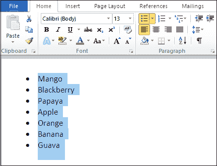
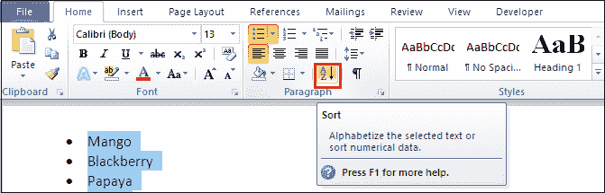
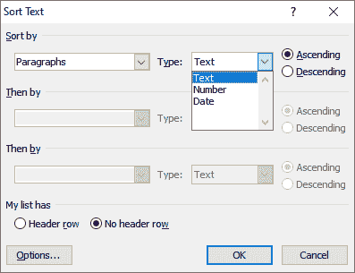
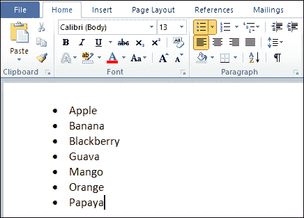
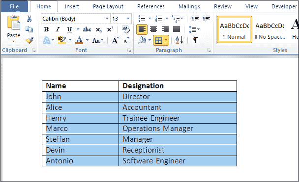
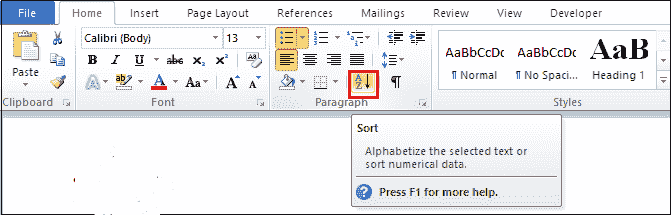
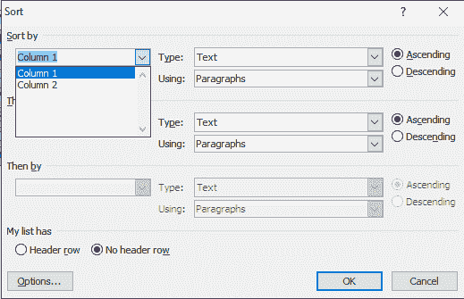
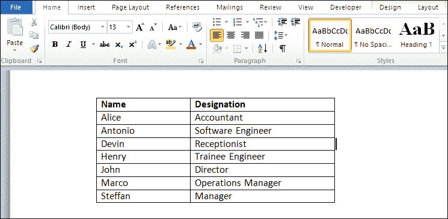

# 如何在微软 Word 中按字母顺序排列数据

> 原文：<https://www.javatpoint.com/how-to-alphabetize-data-in-microsoft-word>

在微软 Word 中，可以将数据按照**字母顺序**和**数字顺序**进行字母排序，这样 Word 文档中的数据就会按照**升序(A 到 Z 或 1 到 9)** 或**降序(Z 到 A 或 9 到 1)** 的顺序出现。

您可以在 Microsoft Word 中使用以下方法按字母顺序排列 Word 文档。

#### 注意:使用以下方法，您可以按字母顺序排列 Word 2007、2010、2013、2016、2019 和 Office 365 中的数据。

### 方法 1:按字母顺序排列单词列表

在[微软 Word](https://www.javatpoint.com/ms-word-tutorial) 中，您可以按字母顺序排列有序和无序的数据列表。

您可以使用以下最简单的步骤在 Word 中按字母顺序排列列表？

**步骤 1:** 打开 Word 文档，创建或选择要按字母顺序排列的数据列表。

**第二步:**选择一个列表，也可以按键盘上的 **Ctrl + A** 键选择列表中存在的数据。

**第三步:**进入功能区的**主页**选项卡，点击**段落**组中的**排序**选项。

**步骤 4:** 屏幕上将出现一个**排序文本**对话框，在该对话框中，在排序文本选项下执行以下操作？

*   从下拉菜单中选择**段落**。
*   从下拉菜单中选择**类型**
*   根据您的要求，点击**上升(A 到 Z)** 或**下降(Z 到 A)** 单选按钮。
*   点击屏幕底部的**确定**按钮。

#### 注意:在我们的例子中，我们使用升序(从 A 到 Z)单选按钮来按字母顺序排列列表。

下面的截图显示了一个列表是以升序(从 A 到 Z)排列的。

### 方法 2:按字母顺序排列表格中的文本

Microsoft Word 允许您以升序或降序对分组在表格中的文本进行字母排序。

按照以下步骤按字母顺序排列表格中的文本？

**步骤 1:** 打开 Word 文档，创建一个表格，或者选择要按字母顺序排列的表格。

**步骤 2:** 选择表格中要按字母顺序排列的**行**和**列**。

**第三步:**进入功能区的**主页**选项卡，点击**段落**组中的**排序**选项。

**步骤 4:** 屏幕上将出现一个排序设置窗口，在该窗口中执行以下操作:

*   在**排序依据**选项上，从下拉菜单中选择要按字母顺序排列的**列**。
*   选择**类型**。
*   选择**上升**或**下降**单选按钮，按字母顺序排列所选列。
*   点击屏幕底部的**确定**按钮。

下面的屏幕截图显示，第 1 列(名称)在表格中按字母顺序排列。

* * *