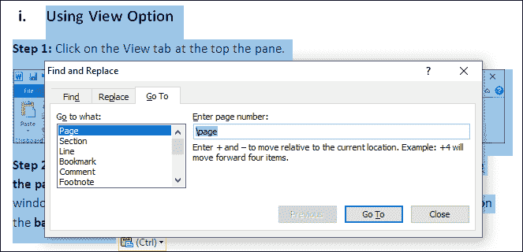

# 如何在 Word 中删除页面

> 原文：<https://www.javatpoint.com/how-to-delete-a-page-in-word>

众所周知，微软 Word 是**创建****编辑**文档的最佳平台。有时可能会有一种可能，就是在文档的中间或末尾添加空白和不必要的页面，分散了读者的注意力，占用了不必要的空间，所以我们必须删除这些页面，以使我们的文档更有吸引力。

我们在 word 文档中删除了以下两种类型的页面？

### 1.文档页面

文档化页面是设计良好的页面，包括**文本、图表、图像、表格和图形**。

### 删除文档页面

删除[字](https://www.javatpoint.com/ms-word-tutorial)中的文档页面有以下几种方式？

### 一、使用退格

退格是删除页面最简单的方法。要使用退格键删除页面，首先，选择要删除的整个页面(按 Ctrl+A)，然后按退格键。

### 二.使用 Ctrl+G 键

Ctrl+G 键是删除文档页面的更快方法。它可以帮助您删除选定的页面。例如，如果您的文档包含 6 页，并且您想要删除第 3 页，那么您可以使用 Ctrl+G 键轻松删除该页。

**第一步:**打开要删除的页面，windows 按 **Ctrl+G** 键，Mac 按 **CMD + G** 键。

**第二步:**屏幕出现**查找并替换**窗口，在**输入页码文本框**中输入**\页面**，按**回车键**。

**第三步:**选中想要删除的文档，如下图截图所示。

**第四步:**现在，点击**关闭**，然后按下键盘上的**删除**键。

### 2.空白页

空白页通常出现在 Word 文档的末尾。删除黑页对我们来说很重要，因为它会给编辑造成不专业的想法，需要打印更多的页面，并且需要更多的内存来将一种文件格式转换为其他文件格式。

### 删除空白页

我们可以用以下几种不同的方法来删除 Word 中的空白页？

### 一、使用退格键

删除空白页是一种非常简单易行的方法。

**第一步:**转到要删除的空白页顶部。

**第二步:**一遍又一遍地按键盘上的退格键，直到空白页最终删除。

### 二.使用视图选项

**步骤 1:** 点击窗格顶部的**查看**选项卡。

**第二步:**勾选“视图”部分的**导航窗格**复选框，选择**浏览您文档中的页面**图标，左侧窗格将显示当前文档窗口中可用页面的列表。选择您想要删除的页面，然后点击**退格键**。

* * *