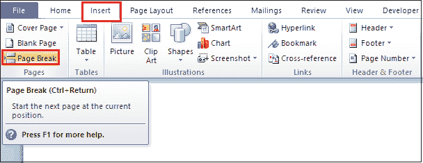
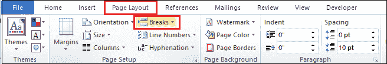
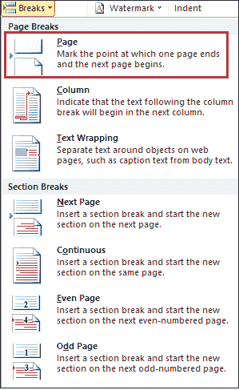
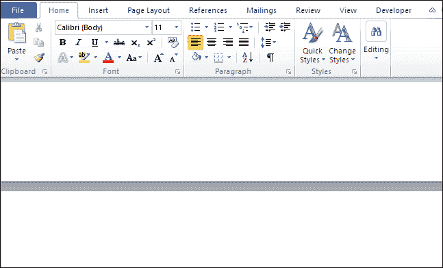
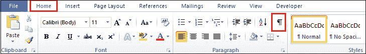
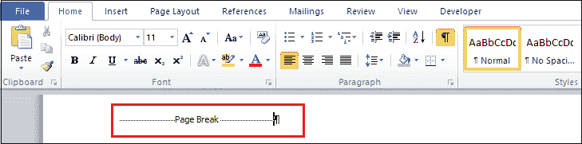
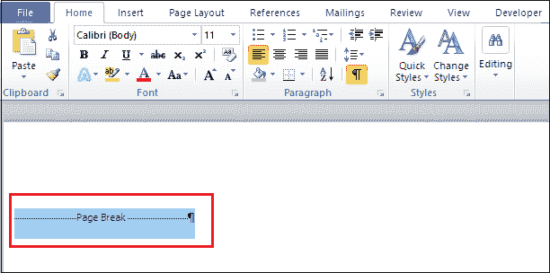
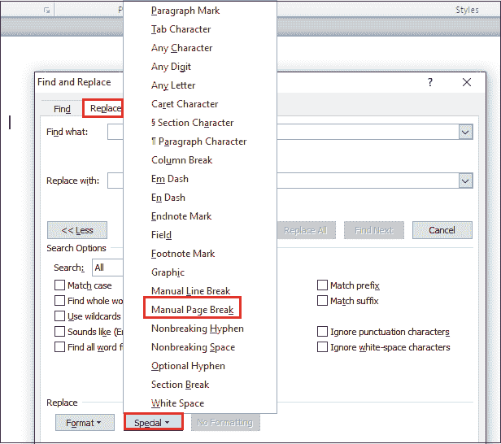
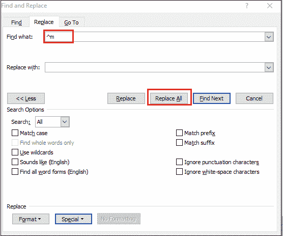
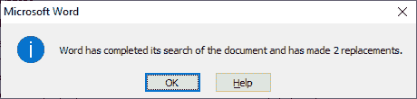

# 如何在 Word 中添加和删除分页符

> 原文：<https://www.javatpoint.com/how-to-add-and-remove-a-page-break-in-word>

分页符是页面布局的一项重要功能，可帮助您在文档中添加新页面。通常，当我们写一个较长的文档，比如项目报告、论文或研究论文时，会使用分页符。分页符的主要目的是将较长的文档分成一系列不同的章节。

## 分页符类型

在 [Microsoft Word](https://www.javatpoint.com/ms-word-tutorial) 中，有三种类型的分页符可以添加到文档中？

**1。简单分页符**

简单分页符是 Word 文档中最常用的分页符。它用于标记页面结束和新页面开始的点。

**2。分栏**

分栏符用于将文档分成多列，而不会丢失 Word 格式。当文档中有多列时，可以使用分栏符。

**3。文字换行**

当文档包含图片时，使用文本换行。

## 在 Word 中添加分页符

在 Microsoft Word 中，当内容不适合页面时，会自动添加分页符。

您可以使用以下最简单的方法在 Word 中添加分页符？

### 方法 1:使用键盘快捷键

在 Word 文档中，可以使用键盘快捷键 **CTRL + Enter** 添加分页符。

将光标放在 Word 文档上。按下 **CTRL +回车**键，对文档应用分页符。

### 方法 2:使用插入选项卡

要在文档中添加分页符，只需遵循以下步骤？

**第 1 步:**将光标放在要向 Word 文档添加分页符的位置。

**第二步:**点击功能区的插入选项卡。

**第 3 步:**点击页面部分的分页符按钮。

下面的截图显示了在 Word 文档中添加了分页符。

### 方法 3:使用页面布局选项卡

按照以下步骤在 Word 中添加分页符？

**步骤 1:** 转到功能区的**页面布局**选项卡。

**第二步:**点击页面设置部分的**断点**选项。

**步骤 3:** 屏幕上出现一个**分页**菜单。根据您的要求选择分页符。

下面的截图显示了在 Word 文档中添加了分页符。

## 从 Word 文档中删除分页符

在微软 Word 中，我们不能手动删除分页符。

### 方法 1:使用删除键删除分页符

按照以下最简单的步骤使用删除键删除分页符？

**第一步:**打开你的 Word 文档。

**步骤 2:** 转到功能区的**主页**选项卡。点击**段落**部分的**显示和隐藏**按钮。

**第三步:**点击**显示/隐藏**按钮后，屏幕出现如下画面。

**第四步:**将光标放在分页符文本的**中心，双击选中。**

**第五步:**按下键盘上的**删除键**。

### 方法 2:使用查找和替换窗口

**步骤 1:** 打开 Word 文档。

**第二步:**从键盘上按下 **Ctrl + H** 键，屏幕上出现一个**查找并替换**窗口。点击屏幕底部的**更多**按钮。

**第三步:**转到**替换**标签。点击一个**特殊**标签，屏幕上会出现一个选项列表，其中点击**手动分页**，如下图截图所示。

**第 4 步:**在**中找到什么**文本框，出现 **^m** 符号。点击**全部更换**按钮。

**第五步:**屏幕出现如下弹出窗口，点击**确定。**

现在，您可以看到从 Word 文档中删除了一个分页符。

#### 注意:使用查找和替换方法，可以删除多个分页符。

* * *