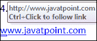

# 如何在 Word 中添加和删除超链接

> 原文:[https://www . javatpoint . com/如何添加和删除 word 中的超链接](https://www.javatpoint.com/how-to-add-and-remove-hyperlink-in-word)

超链接也被称为**链接**或**网络链接**。这通常是**蓝色或紫色文本**，您可以在文档中使用它来访问新文档或当前文档中的特定部分。

超链接允许您以下列形式访问文档:

*   文本
*   文件
*   图像
*   资源定位符
*   录像
*   控件(按钮)

### 在 Word 文档中添加超链接

添加超链接有助于用户轻松访问相关网页。

要在 Word 文档中添加超链接，可以采用以下方法-

### 方法 1:使用键盘键

在 Word 文档中插入超链接是最简单快捷的方法。

1.  打开要插入超链接的 Word 文档。
2.  键入网页的地址。
3.  将光标放在网页地址后，按**回车**或**空格键**键。
4.  现在，您可以看到 Word 自动将网址转换为超链接。

[www.javatpoint.com](https://www.javatpoint.com)

按 **Ctrl +点击**进入超链接。

### 方法 2:使用链接选项

按照以下步骤使用链接选项添加超链接。

**第一步:**打开要添加超链接的 Word 文档。

**第二步:高亮显示或选择想要创建超链接的文本**。**右键单击所选文本上的**，屏幕上将出现一个选项列表。点击**超链接**选项，如下图所示。

**步骤 3:** 屏幕上将出现一个**插入超链接对话框**，在该对话框中执行以下操作:

*   从**链接到:部分**点击现有文件或网页选项。
*   从**查看:部分**点击当前文件夹选项。
*   选择文档，或者您也可以键入要与超链接链接的网页地址。
*   点击屏幕底部的**确定**按钮。

下面的截图显示了在 Word 文档中添加了一个超链接。

## 编辑超链接

在 Word 文档中创建超链接后，还可以根据需要对其进行编辑。

按照以下步骤编辑 Word 文档中的超链接-

**第一步:**打开 Word 文档。

**第二步:右键点击想要编辑的文档**。

**步骤 3:** 屏幕上将出现选项列表窗口。点击**编辑超链接**选项。

**第四步:**屏幕上将出现**编辑超链接**对话框。**根据您的要求编辑超链接**，点击屏幕下方的**确定**按钮。

**或**

**高亮显示想要编辑的超链接**，点击键盘上的 **Ctrl+K** 键。

## 删除超链接

移除超链接对于[微软 Word](https://www.javatpoint.com/ms-word-tutorial) 用户来说并不是一件难事。您可以使用以下最简单的方法从 Word 文档中删除超链接。

### 方法 1:删除一个超链接

要从 Word 文档中删除超链接，请选择要删除的超链接，然后按键盘上的 **Ctrl+Shift+F9** 键。

### 方法 2:删除所有超链接

微软 Word 允许您使用以下步骤删除所有超链接&-

1.  打开 Word 文档。
2.  按 **Ctrl+A** 选择 Word 文档中存在的所有文本。
3.  从键盘上按下 **Ctrl+Shitf+F9** 键，删除所有超链接。

完成上述步骤后，您可以看到所有超链接都已从 Word 文档中删除。

### 方法 3:使用超链接对话框删除超链接

按照以下步骤从 Word 文档中删除超链接:

**第一步:**打开要删除超链接的 Word 文档。

**第二步:高亮显示或选择想要移除的超链接**。

**第三步:在选中的文本上右键**，屏幕上会出现一个选项列表。点击**移除超链接**选项移除超链接。

现在，您可以看到超链接已从 Word 文档中删除。

* * *