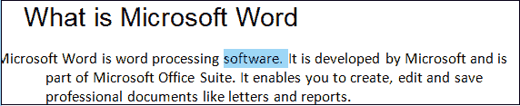
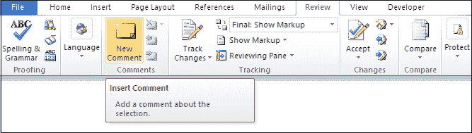
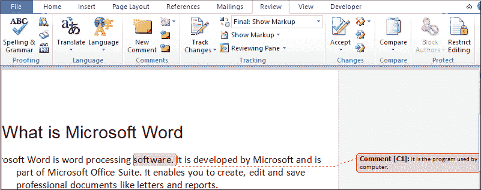
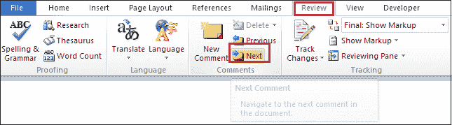
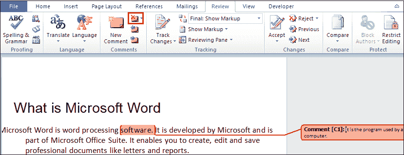

# 如何在 Word 中插入或删除注释

> 原文：<https://www.javatpoint.com/how-to-insert-or-remove-the-comment-in-word>

注释是 Word 文档中最重要和最有用的功能。用来给别人提建议，让文档更容易理解。通常，当多人在处理同一文档时，会使用注释。

### 插入注释

要在 [Microsoft Word](https://www.javatpoint.com/ms-word-tutorial) 文档中插入注释，请执行以下步骤:

**步骤 1:** 打开 Word 文档。

**第二步:高亮显示想要评论的文字**或者**点击想要评论的文字**末尾。

**第三步:**进入功能区的**评论**标签，点击评论区的**新评论**图标。

**第四步:**屏幕上会出现一个**评论对话框**。**在评论框**中输入想要插入的文字。

### 编辑评论

按照下面提到的最简单的步骤在 Word 文档中编辑注释-

**第一步:**打开 Word 文档。

**第二步:**选择想要编辑的评论。

**第三步:**Word 文档右侧会出现一个注释对话框。单击注释，删除先前的注释，并开始绑定要添加到文档中的新注释。

### 删除评论

您可以在 Word 文档中使用以下步骤来删除注释:

**第一步:**打开要删除注释的 word 文档。

**第二步:**转到功能区的**评论**，点击**评论**部分下的**下一步**图标选择评论。

**第三步:**选择评论后，点击评论区的**删除**按钮。

现在，您会发现注释已从 Word 文档中删除。

* * *