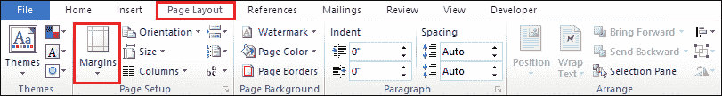
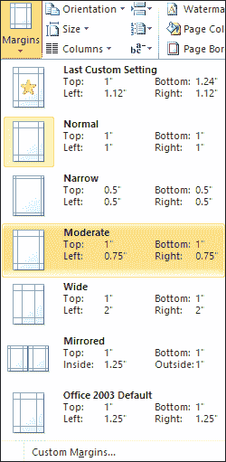
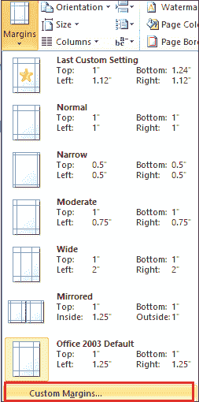
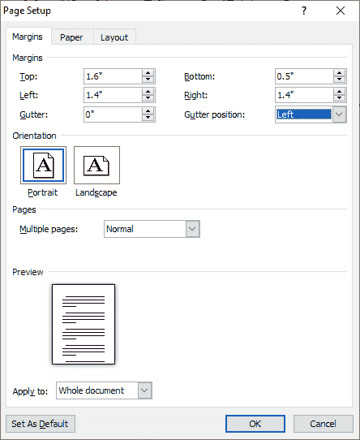
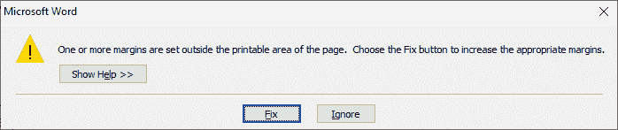

# 如何在 Word 中更改边距

> 原文：<https://www.javatpoint.com/how-to-change-margins-in-word>

边距是 word 文档周围的**空白区域**。可以在文档的**顶部、底部、右侧和左侧**调整边距。

#### 注意:在 Microsoft Word 中，每页都自动设置了一英寸的边距。

更改 Word 文档中的边距有以下步骤-

**第一步:**打开要设置边距的 Word 文档。

**第二步:**进入功能区的**页面布局**选项卡，点击**页面设置**向上组中的**页边距**选项。

**第 3 步:**屏幕上会出现一个边距列表。根据你的要求选择保证金。

现在，您可以看到您选择的边距应用于 word 文档。

## 创建自定义边距

在[微软 Word](https://www.javatpoint.com/ms-word-tutorial) 中，也可以根据自己的需求创建自定义边距。

在 Word 中创建自定义边距有以下步骤-

**第一步:**打开 Word 文档。

**第二步:**转到功能区的**页面布局**选项卡，点击**页面**设置组中的**页边距**。M

**步骤 3:** 屏幕上出现一个边距窗口。点击屏幕下方的**自定义边距**。

**第 4 步:**屏幕上出现一个**页面设置**窗口，选择**边距选项卡**。在边距下，根据您的要求选择边距，然后单击屏幕底部的**确定**按钮。

**第五步:**屏幕出现如下弹出窗口。点击**修复**按钮。

**第 6 步:**再次点击页面设置菜单中的**确定**按钮。

* * *