# 如何在 Word 中创建悬挂缩进

> 原文：<https://www.javatpoint.com/how-to-create-a-hanging-indent-in-word>

在 Microsoft Word 中，缩进用于调整 Word 文档的边距。

#### 注意:要在 Microsoft Word 中创建缩进，我们需要启用标尺。

### 启用标尺

要启用标尺，请转到功能区上的**查看**选项卡，并在**显示**组中的标尺复选框上勾选**。**

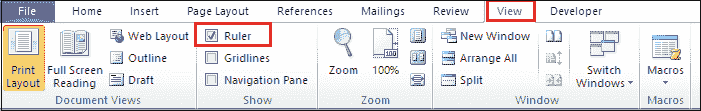

现在，您可以看到标尺被添加到 Word 文档中。

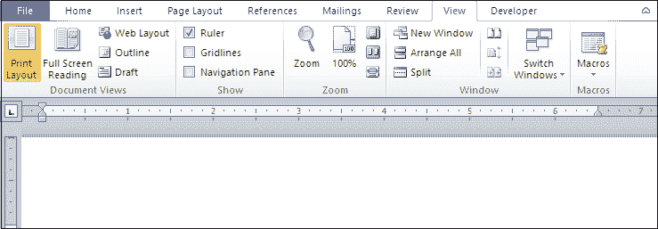

您可以在[微软 Word](https://www.javatpoint.com/ms-word-tutorial) 中使用以下类型的意图:

### 1.悬挂式缩进

悬挂缩进也称为 ***第二行缩进或悬挂段落*** 。它允许您在不更改段落第一行的情况下更改段落的其余行。

在 Word 文档中创建悬挂缩进有以下几种方法

**方法一:使用尺条**

1.打开 Word 文档。

2.将光标放在要创建悬挂缩进的段落中。

3.转到**标尺栏**选择**挂线缩进**，如下图截图所示。

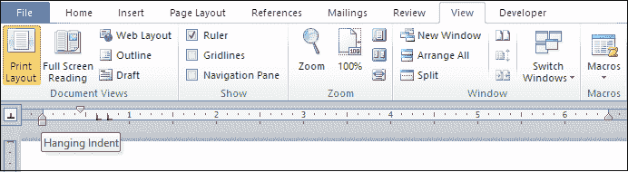

4.**移动悬挂缩进标尺上的光标**调整段落。屏幕上出现一条**虚线**。

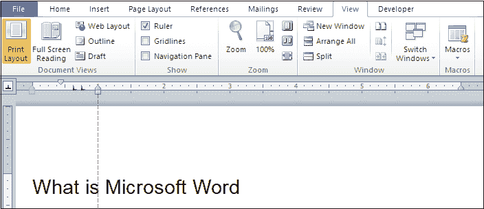

下面的截图显示了在 Word 文档中创建的悬挂缩进标尺。

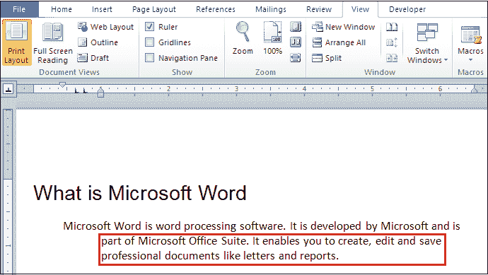

**方法二:使用段落对话框**

使用段落对话框创建悬挂缩进有以下步骤-

**步骤 1:** 打开 Word 文档。

**步骤 2:** 选择要创建悬挂缩进的段落。

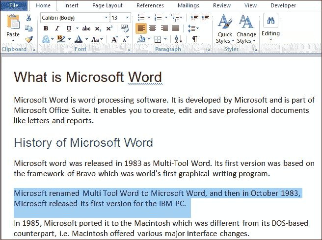

**第三步:**转到功能区的**主页**选项卡，点击**段落**组中的**显示段落对话框**。

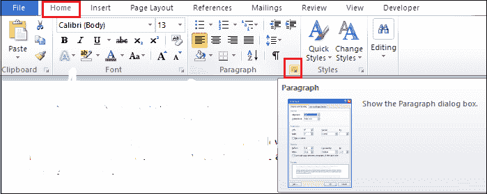

**第四步:**屏幕上会出现一个段落设置对话框，从下拉菜单中选择**悬挂**，使用 **By** 选项选择缩进深度，点击**确定**按钮，如下图截图所示。

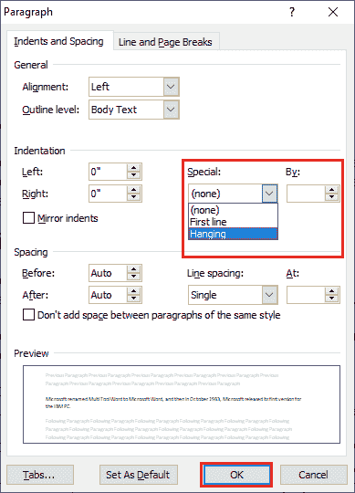

#### 注意:默认情况下，缩进深度为 0.5。

下面的截图显示悬挂缩进是在 Word 文档中创建的。

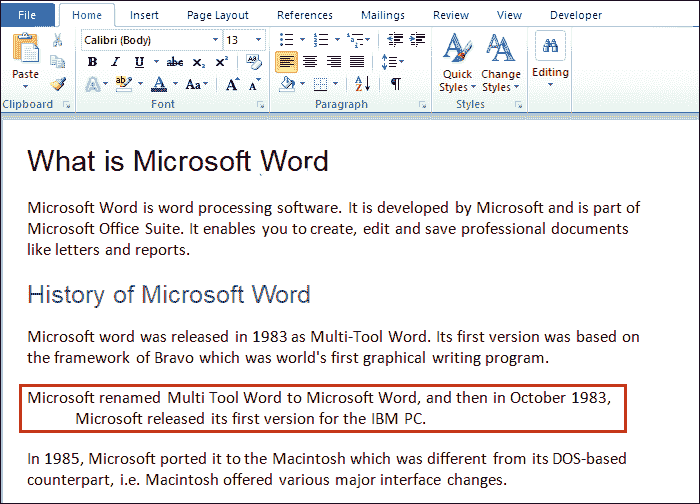

**方法三:使用键盘快捷键**

在 Word 文档中创建悬挂缩进是最简单的方法。

将光标放在要创建悬挂缩进的段落上。

**1。**从键盘按下 **Ctrl + T** 键至**增加一段的悬挂缩进量**。

2.从键盘按下 **Ctrl + Shift + T** 键至**减少一段的悬挂缩进**。

### 2.首行缩进

首行缩进用于缩进唯一的首行。

**方法一:使用尺条**

按照以下步骤使用标尺栏创建首行缩进-

**第一步:**将光标放在段落的第一行之前。

**第二步:**转到**标尺**选择**首行缩进**，如下图截图所示。

**第三步:**在标尺上向左移动光标。一条**虚线**将出现在屏幕上。

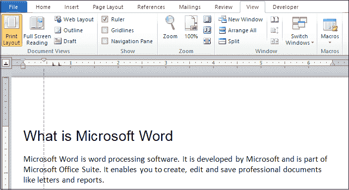

现在，您可以看到第一行意图是在 Word 文档中创建的。

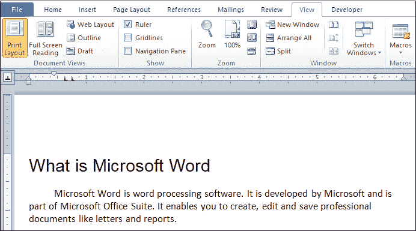

**方法二:使用段落对话框**

#### 注意:遵循使用段落对话框创建悬挂缩进中提到的步骤 1 到步骤 4。

屏幕上会出现一个段落设置窗口，从下拉菜单中选择**第一行**，使用 **By** 选项选择缩进深度，点击**确定**按钮，如下图截图所示。

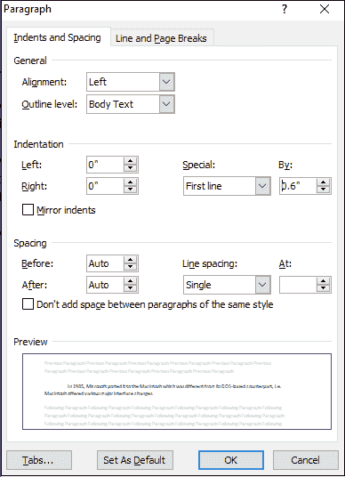

下面的截图显示了在 Word 文档中创建的首行缩进。

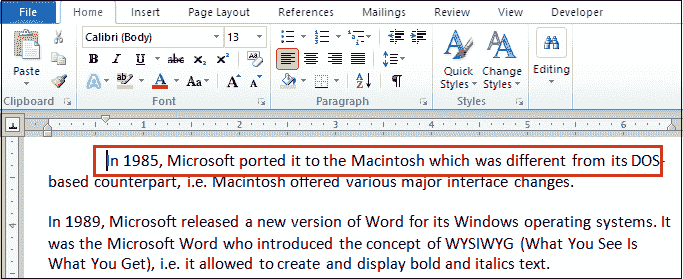

### 3.左右缩进

#### 注意:遵循使用段落对话框创建悬挂缩进中提到的步骤 1 到步骤 4。

屏幕上将出现段落设置窗口。

*   如果要应用**左缩进**，那么**从下拉菜单中选择左缩进**值。
*   如果要应用**右缩进**，那么**从下拉菜单中选择右缩进**值。

选择左缩进值或右缩进值后，单击屏幕底部的“确定”按钮。

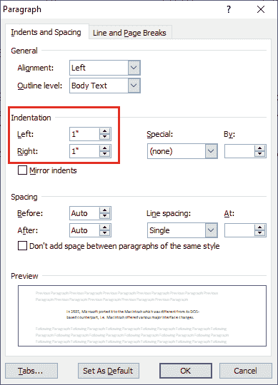

### 删除缩进

**使用快捷键**

要删除缩进，可以按键盘上的 **Ctrl + Q** 键。

**使用段落对话框**

按照以下步骤删除使用段落缩进对话框-

**步骤 1:** 打开 Word 文档。

**步骤 2:** 选择要删除缩进的段落。

**第三步:**转到功能区的**主页**选项卡，点击**段落**组中的**显示段落对话框**。

**第四步:**屏幕上会出现一个段落设置窗口。从下拉菜单中选择**无**，点击**确定**按钮，如下图截图所示。

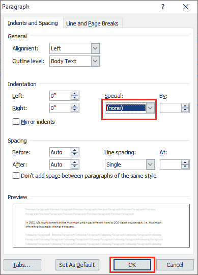

现在，您可以看到缩进已从 Word 文档中删除。

* * *