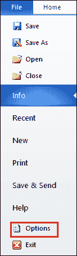
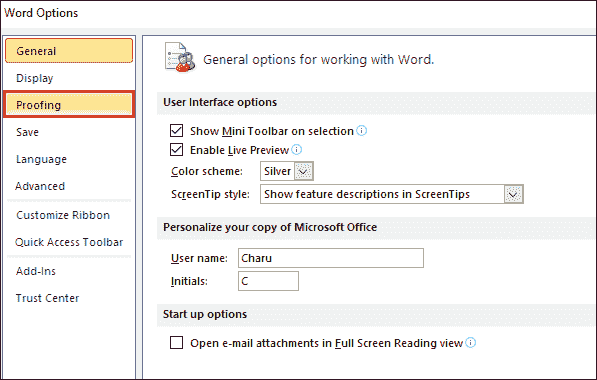
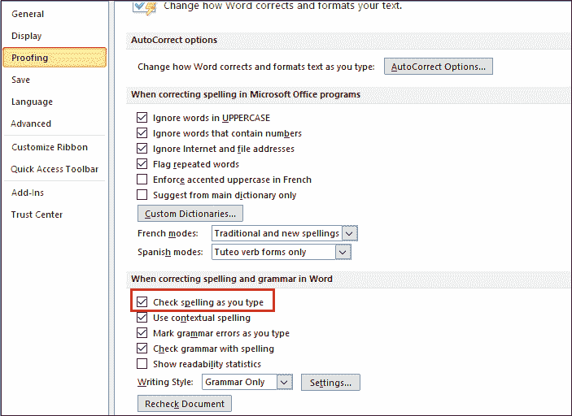
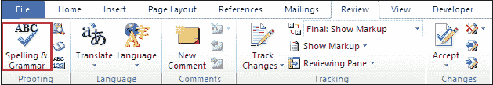
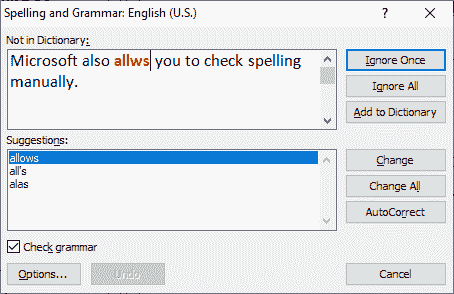
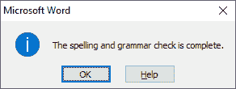

# 如何启用单词拼写检查

> 原文:[https://www . javatpoint . com/如何启用拼写检查单词](https://www.javatpoint.com/how-to-enable-spell-check-in-word)

所有 Microsoft Word 版本都具有拼写检查功能，允许您检查拼写以及纠正在 Word 文档中出现的语法错误。

在 [Microsoft Word](https://www.javatpoint.com/ms-word-tutorial) 中，拼错的单词会出现红色波浪下划线，如下图所示。

**Mago、allw、wter、wodr、chek、scren 等等。**

启用单词拼写检查有以下步骤-

**第一步:**打开 Word 文档。

**第二步:**转到屏幕左上角的**文件**选项卡。屏幕上将出现文件选项列表。点击**选项**按钮。

**第三步:**屏幕上会出现一个单词**选项对话框**，点击左侧窗格的**打样**。

**第四步:**现在，在输入时勾选**检查拼写复选框，并点击**确定**按钮，如下图所示。**

## 手动检查拼写

Microsoft 还允许您手动检查拼写。为此，请转到功能区上的**查看**选项卡，然后单击“校对”组中的**拼写&语法**选项。

**案例 1:** 如果您的 Word 文档中有任何拼写错误，则会出现以下对话框，红色文本中出现拼写错误的单词。

要纠正拼写，进入**建议选项卡**，选择正确的拼写，点击**更改**按钮。

#### 注意:如果不想更改拼写，请单击“忽略一次”按钮。

**情况 2:** 如果 Word 文档中的所有拼写都正确，那么屏幕上会出现如下弹出窗口，点击**确定**按钮。

* * *