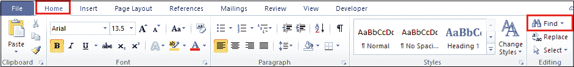
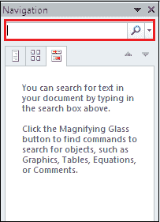
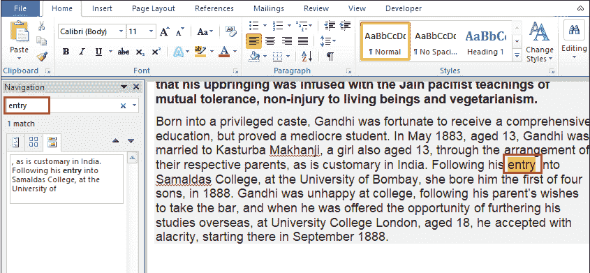
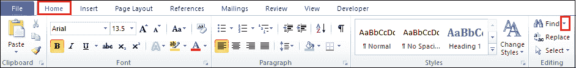
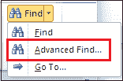
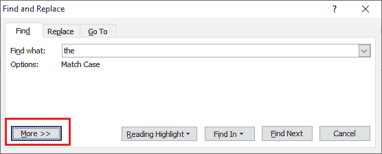
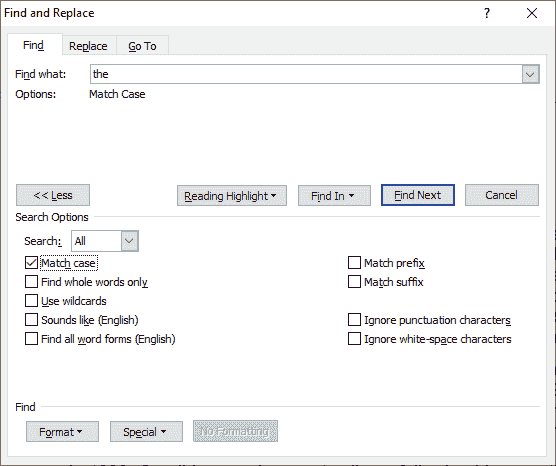
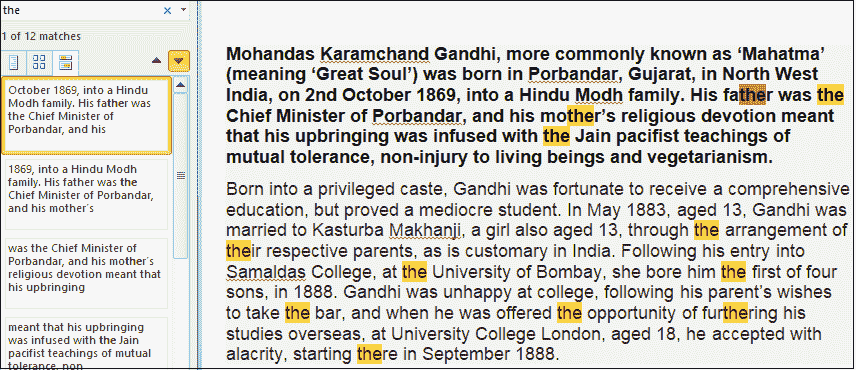

# 如何在 Word 文档中搜索单词

> 原文:[https://www . javatpoint . com/如何在 word 文档中搜索单词](https://www.javatpoint.com/how-to-search-for-words-in-a-word-document)

微软包括一个搜索功能，可以帮助你在 Word 文档中轻松找到各种**字符、单词**和**短语**。一般来说，当我们处理长的[微软 Word](https://www.javatpoint.com/ms-word-tutorial) 文档时，会使用搜索选项。

#### 注意:我们可以在 Word 2010、Word 2013、Word 2016、Word 2019、Word Online 和 Microsoft 365 上应用以下方法来搜索单词。

您可以使用下面提到的步骤在 word 文档中搜索单词-

**第一步:**按下 **Ctrl+F 键**或转到功能区的**主页选项卡**，点击**查找**选项。

#### 注意:对于旧版本的 Microsoft Word，请转到文件->文件搜索。

**步骤 2:** 屏幕上出现搜索**导航**窗格。在搜索框中键入要在文档中搜索的单词。

**第三步:**截图显示搜索词是主 word 文档中**高亮显示的**。

### 设置高级搜索功能

1.转到**主页**选项卡，点击与**查找**选项相关的下拉图标。

2.从下拉菜单中点击**高级查找**。

3.屏幕上出现**查找和替换**对话框。点击**更多**。

4.**选择要应用的选项**。

现在，当您搜索一个单词时，它也会突出显示匹配的案例，如下图所示。

* * *