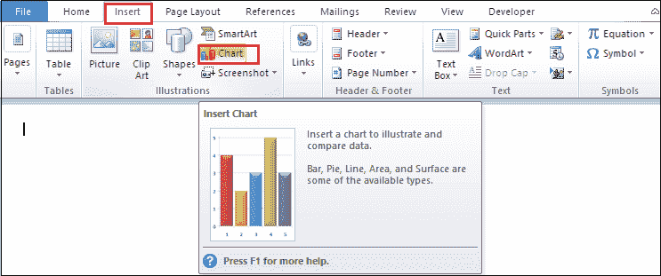
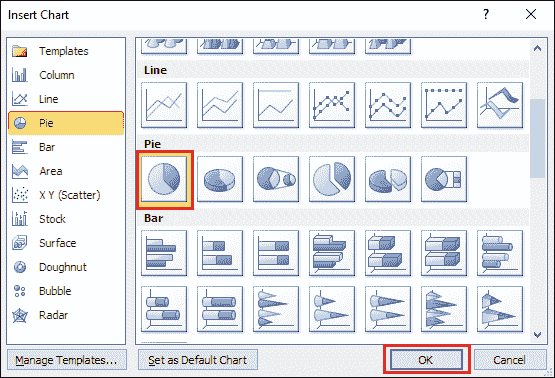
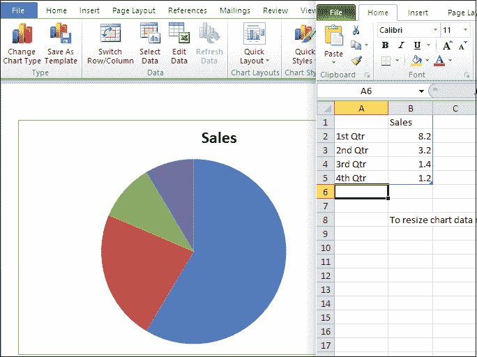
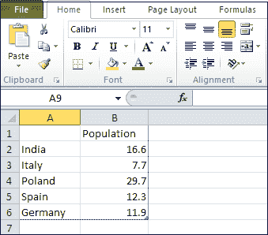
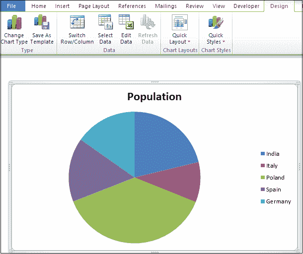

# 如何在 Word 中创建饼图

> 原文：<https://www.javatpoint.com/how-to-create-a-pie-chart-in-word>

微软 Word 提供了多种图表，包括**折线图、面积图、条形图、**和**饼图**。饼图是最流行的图表类型，用于以圆形形式显示数据、信息和统计数据。饼图又称**饼图、圆形图、**和**圆形图**。

### 创建饼图

在 Word 文档中插入饼图有以下步骤-

**第一步:**打开 Word 文档。

**步骤 2:** 将光标放在文档中要创建饼图的位置。现在，转到功能区的**插入**选项卡，点击**插图**组下的**图表**图标。

**第三步:**屏幕上将出现**插入图表对话框**。选择要插入 Word 文档的饼图，点击屏幕下方的**确定**按钮。

单击**确定**按钮后，饼图和 excel 电子表格出现在屏幕上。

### 在饼图中添加数据

在 Word 文档中创建饼图后，可以根据需要在其中添加数据。

要添加数据，请转到 excel 电子表格并开始添加数据。

下面的截图显示你想要的数据被添加到饼图中。

## 饼图的优势

饼图的优势列表如下-

*   饼图简单易懂。
*   它为观众或读者提供了一种有效的交流方式。
*   它提供即时分析和快速理解的信息。
*   它提供了出色的数据可视化表示。
*   它需要更少的额外解释。
*   它比其他类型的图形更简单。

## 饼图的缺点

饼图有流动的缺点-

*   如果有大量的数据要使用，那么饼图就变得不那么有效了。
*   很难从数据中揭示准确的数值。
*   难以表示多组数据。
*   在饼图中，数据切片的比较存在问题。

* * *