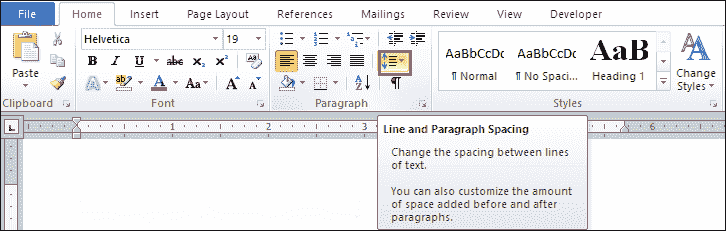
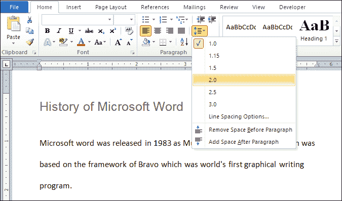
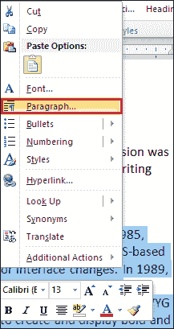
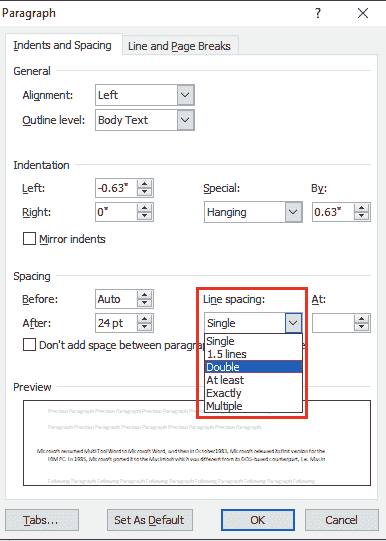
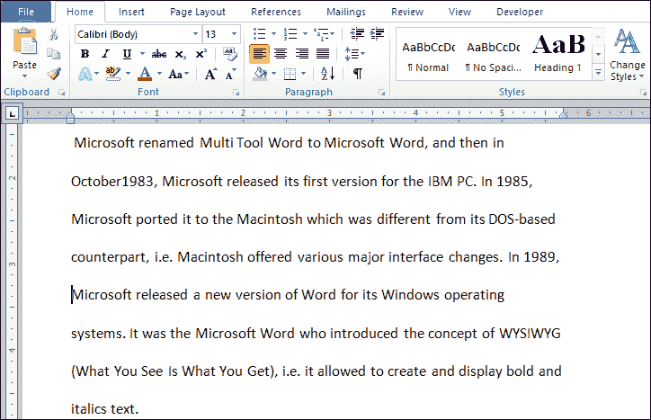

# 如何在微软 Word 中加倍空格

> 原文:[https://www . javatpoint . com/如何在 microsoft-word 中加倍空格](https://www.javatpoint.com/how-to-double-space-in-microsoft-word)

在 Word 文档中启用双空格有助于您轻松阅读、编辑和做笔记。

### 方法 1:为整个 Word 文档启用双空格

以下是为整个 Word 文档启用双空格的步骤-

**第 1 步:**打开要为文档启用双空格的 Word 文档。

**第二步:**使用键盘上的 **Ctrl+A** 键选择整个文档。

**第三步:**转到功能区的**主页**选项卡，点击**段落组**中的**行和段落间距**图标。

**第四步:**一旦点击**行和段落间距**图标，屏幕上会出现一个弹出窗口。根据您的要求选择**间距号**。

现在，您可以看到在您的 Word 文档中添加了双倍行距。

#### 注 1:使用上述步骤，可以在 Microsoft Word 2007 和 Microsoft Word 2010 中启用双空格。

#### 注 2:也可以从键盘按 Ctrl+2 键启用双空格，从键盘按 Ctrl +1 键启用 Word 文档中的单空格。

### 方法:2 在段落中启用双空格

按照以下最简单的步骤在 Word 文档中启用双倍行距-

**步骤 1:** 打开 Word 文档。

**第二步:高亮显示或选择想要启用双倍行距的段落**。

**第三步:**右键点击选中的段落，屏幕上会出现一个选项列表。点击此列表中的**段落**选项。

**第四步:**屏幕上会出现一个段落对话框。转到**间距**选项卡，从**行距**下拉菜单中单击**双**，然后单击**确定**按钮，如下图所示。

完成所有步骤后，您可以看到所选段落中启用了双倍行距。

* * *