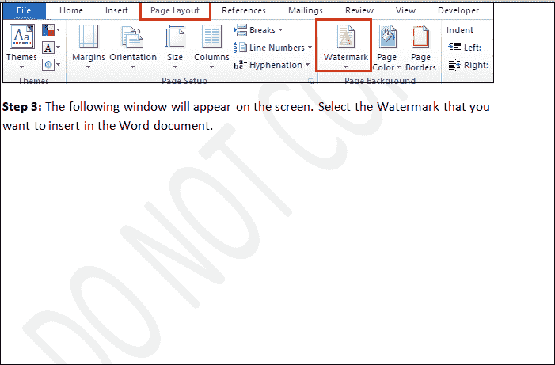

# 如何在 Word 中插入水印

> 原文:[https://www . javatpoint . com/如何插入文字水印](https://www.javatpoint.com/how-to-insert-a-watermark-in-word)

水印是显示在 Word 文档中文本后面的**背景图像**。水印帮助我们**识别特定文件相关的制造商或品牌**。

默认情况下，微软水印为:**机密**(水平和对角线)**不复制**(水平和对角线)**紧急****尽快**。

在 Word 文档中插入水印有以下步骤-

**第 1 步:**打开或创建一个要插入水印的新 Word 文档。

**第二步:**进入功能区的**页面布局**选项卡，点击**页面背景**部分的**水印**选项。

#### 注意:要在 Word 2013、2016、2019 和 Office 365 中插入水印，请单击功能区上的“设计”选项卡，然后转到背景部分下的“水印”。

**第三步:**屏幕上会出现如下窗口。选择要在 Word 文档中插入的水印。

下面的截图显示了一个水印被插入到 Word 文档中。

### 自定义水印

Microsoft Word 允许您在文本后面创建和插入自定义水印。

在微软 Word 中，有两种类型的自定义水印可用-

*   文本水印
*   图片水印

### 在 Word 中插入文本水印

要插入文本水印，请执行以下步骤。

**第一步:**打开 Word 文档。

**第二步:**转到功能区的**插入**选项卡，点击**页面背景**部分的**水印**选项。

**第三步:**屏幕上会出现如下窗口。点击**自定义水印**选项。

**第四步:**屏幕上会出现一个**打印水印**对话框。点击**文本水印**单选按钮，并执行以下操作:

**点击语言:**从水印的下拉菜单中选择语言。

**文本:**键入要作为水印插入到文档中的文本。

**字体:**点击与该字体关联的下拉菜单，选择要添加水印的字体。

**大小:**选择水印的大小。

**颜色:**选择要添加到水印的文本的颜色。

**布局:**单击水印的对角线或水平布局。

完成后，点击屏幕底部的**确定**按钮。

下面的截图显示自定义水印被插入到 Word 文档中。

### 插入图片水印

Microsoft Word 不仅允许您在文本中插入水印，还允许您以图像的形式插入水印。图像水印可以是公司的**标志**或**简单吸引人的图像**。

您可以使用以下步骤插入图片水印:

**第一步:**打开 Word 文档。

**第二步:**进入**页面布局**选项卡，点击**水印**选项。

**第三步:**屏幕出现一个窗口，点击**自定义水印**。

**第四步:**屏幕上会出现一个**印刷水印**对话框。点击**图片水印**单选按钮，点击【选择图片】按钮浏览想要插入的图片，点击屏幕下方的**确定**按钮。

下面的截图显示图片水印被插入到 Word 文档中。

## 移除水印

去除水印有以下步骤-

**步骤 1:** 打开 Word 文档。

**步骤 2:** 转到功能区的**页面布局**选项卡，单击段落部分的水印选项。

**第三步:**屏幕上会出现如下窗口，点击**去除水印**选项。

#### 注意:您也可以使用页眉和页脚选项删除水印。

* * *