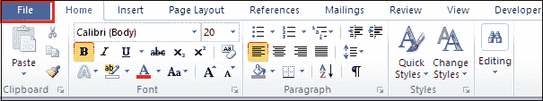
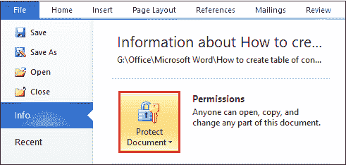
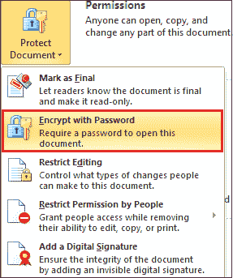
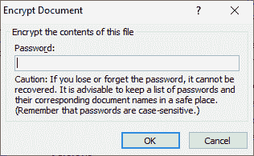
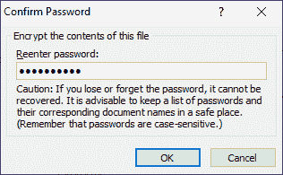
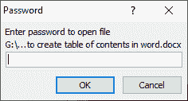

# 如何对 word 文档进行密码保护

> 原文:[https://www . javatpoint . com/如何对 word 文档进行密码保护](https://www.javatpoint.com/how-to-password-protect-a-word-document)

密码保护有助于保护您的文档安全，防止未经授权的访问。没有输入密码，任何人都不能访问或阅读受密码保护的文档。在 Microsoft Word 中，密码区分大小写，一般在 15 个字符的范围内。

#### 注意 1:请始终记住您的 Word 文档密码，因为如果您忘记了密码，Microsoft Word 将无法恢复您的密码。

#### 注意 2:不要在邮件中与受密码保护的文件共享受密码保护的 word 文档。

如果您在 Word 文档中的数据是敏感的，您可以按照以下步骤对您的 Word 文档进行密码保护-

#### 注意:使用下面提到的步骤，您可以在 Word 2007、2010、2013、2016、2019 和 Office 365 中启用密码保护。

**第一步:双击想要保护的 Word 文档上的**。

**第二步:**点击屏幕左上角的**文件**标签。

**第三步:**进入**信息**选项卡，点击**保护文件**选项。

**第 4 步:**屏幕上会出现如下窗口，点击**用密码加密。**

**第五步:**屏幕上会出现一个小的**加密文档**窗口。**输入密码**保护您的文件，然后点击**确定**按钮。

#### 注意:尽量使用容易记忆且复杂的密码。

**第六步:**屏幕上会出现一个**确认密码**窗口。再次输入密码确认您的密码，然后点击**确定**按钮。

**第七步:保存**Word 文档，**关闭**。

一旦完成上述步骤，每次打开受密码保护的文档时，总会看到**输入密码**解密受保护文档内容的对话框，如下图截图所示。

#### 注意:一旦设置了 word 文档的密码，不输入密码就无法打开和查看，所以一定要确保将密码保存在安全的地方。

#### 注意:在 Microsoft Office 2016 中，默认的加密方法是 AES-256。

#### 注意:使用上述步骤，您还可以在微软 Excel 和微软 PowerPoint 中启用密码保护。

## 如何从 word 文档中删除密码

Microsoft Word 还允许您解锁受密码保护的 Word 文档。

您可以使用以下最简单的步骤从 word 文档中删除密码

**第一步:**打开密码保护的 word 文档。

**第二步:输入密码**点击**确定**按钮进入 word 文档。

**第三步:**点击屏幕左上角的**文件**标签。

**第四步:**进入**信息**点击**保护文件**选项。

**第五步:**屏幕上会出现如下窗口。点击**密码加密**选项。

**步骤 6:** 屏幕上出现一个**加密文档**窗口。按下键盘上的退格键删除之前的密码，然后点击屏幕底部的**确定**按钮。

**第 7 步:**点击**关闭**标签。点击关闭选项卡后，屏幕上会出现一个对话框，点击**保存**按钮保存文件并更改密码保护。

现在，当您打开文档时，您可以看到该文档已打开，而不显示“输入密码”对话框。

* * *