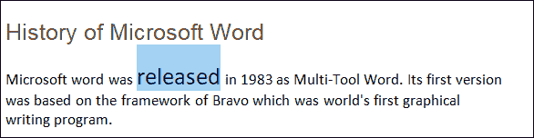
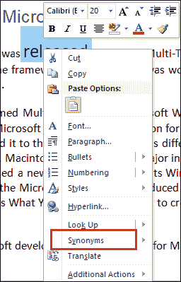
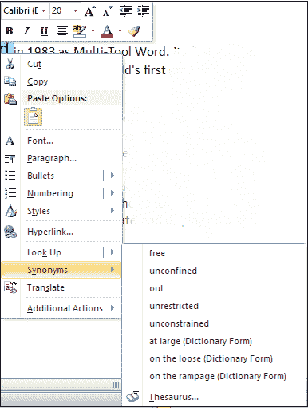
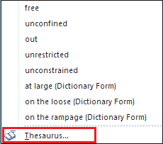
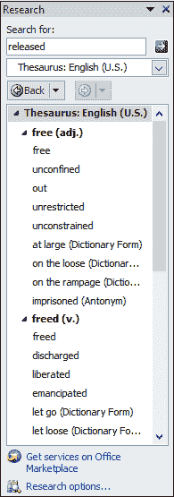
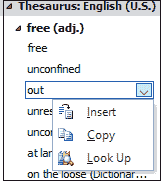
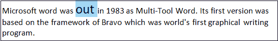
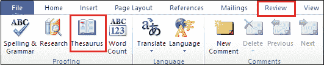
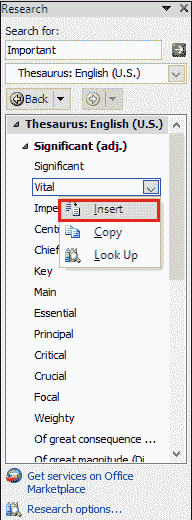

# 如何在 Word 文档中使用同义词库

> 原文：<https://www.javatpoint.com/how-to-use-a-thesaurus-in-word-document>

同义词库是一种软件工具，用于在 Microsoft Word 文档中查找(查找)所选单词的同义词(含义相同的单词)和反义词(含义相反的单词)。

通常，当我们写电子邮件、信件、项目报告或研究论文时，会在 Word 文档中使用同义词库。

#### 注意:同义词库也用于微软的 PowerPoint 和 Outlook。

## 方法 1:使用同义词选项

此方法用于 Word 文档的桌面版本。这是在 Word 中使用同义词库最简单快捷的方法。

要在 Word 文档中使用同义词库，请按照下列步骤操作-

#### 注意:使用以下步骤，您可以在 Word 2003、2010、2013 和 2019 中使用同义词库。

**步骤 1:** 打开新的 Word 文档或现有的 Word 文档。

**第二步:键入一个新单词或从现有文档中搜索一个单词**作为同义词库。

**第三步:突出显示键入或选择的单词**。单词后面会出现蓝色背景。

**第四步:右键点击选中或输入的单词**。屏幕上将出现一个下拉菜单。将光标放在**同义词**选项上。

**第五步:**一旦将光标放在同义词选项上，屏幕右侧或左侧会弹出一个同义词列表窗口，如下图截图所示。

**第五步:**点击弹出窗口底部的**词库**。

**第 6 步:**以下窗格将出现在 Word 文档的右上角。

#### 注意:您选择的单词将出现在搜索:文本框字段中。如果看不到，请在搜索框中键入您想要的词，然后按键盘上的回车键。

**第 7 步:**选择要插入的同义词库单词，点击与所选单词相关的下拉图标。以下选项将出现在屏幕上。点击**插入**按钮。

现在，您可以看到所选单词在 word 文档中被替换为它的同义词。

## 方法 2:使用功能区上的“审阅”选项卡

您也可以使用“审阅”选项卡使用同义词库。

使用“审阅”选项卡使用同义词库有以下步骤-

**步骤 1:** 打开新的 Word 文档或现有的 Word 文档。

**第二步:**在文档中键入要查找的单词(同义词库)

**第三步:**进入功能区的**复习**选项卡，点击**校对**部分的**词库**选项，也可以直接按**快捷键 Shift + F7** 。

**第 4 步:**在 Word 文档的右上角出现以下屏幕，在其中执行以下操作:

*   选择单词。
*   单击与所选单词相关联的下拉图标。
*   一个小的下拉菜单出现，点击插入。

下面的截图显示一个单词**重要**被它的同义词**重要**代替。

* * *