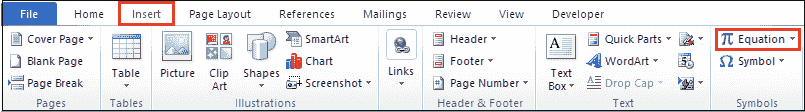
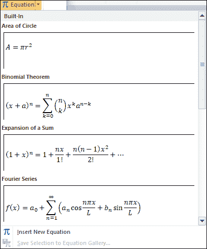
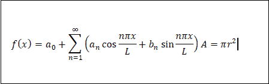
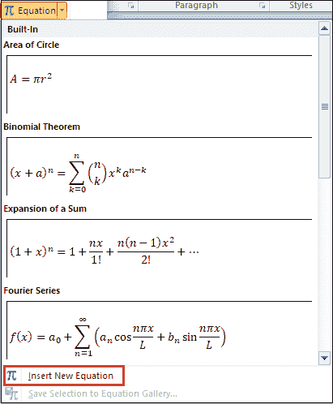
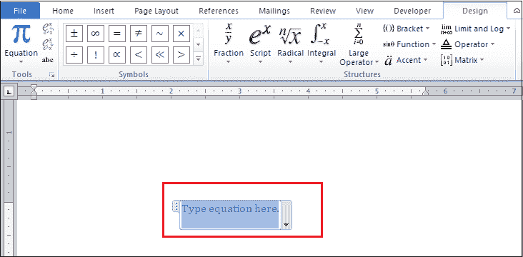
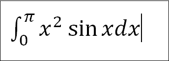

# 如何在 Word 文档中插入公式

> 原文：<https://www.javatpoint.com/how-to-insert-equations-in-word-document>

Microsoft Office 包含几乎所有允许您在 Word 文档中插入数学公式和化学公式的符号。

### 方法 1:插入预设方程

要在 Word 文档中插入预设公式，请遵循下面提到的最简单的步骤-

**第一步:**打开 Word 文档。

**第二步:**将光标放在文档中要插入公式的位置。

**第三步:**进入 ***在功能区插入*** 选项卡，点击屏幕右上角**符号**部分的**方程**下拉图标。

**第四步:**屏幕上会出现如下对话框，选择要插入的方程式。

下面的截图显示在 Word 文档中插入了一个预设公式。

### 方法 2:手动插入等式

除了预设的公式，您还可以根据需要在 Word 文档中手动插入公式。

**第一步:**打开 Word 文档。

**第二步:**转到功能区的**插入选项卡**，点击屏幕右上角**符号**部分的 E **四行**下拉图标。

**第三步:**屏幕上会出现如下窗口，点击**插入新方程**选项。

**第四步:**在这里输入方程式屏幕上会出现方框。

**第 5 步:**现在，方程式工具将自动出现在功能区中。将公式从要插入 Word 文档的设计选项卡中拖动出来。

下面的截图显示了一个公式被手动插入到 Word 文档中。

### 方法 3:使用键盘键插入公式

这是在 Word 文档中插入一个等式的更快的方法--

**第一步:**打开 Word 文档。

**第二步:**将光标放在文档中要插入公式的位置。

**第三步:**按下键盘上的 **Alt 键和=** 键。屏幕上将出现“在此插入等式”框。

**第 4 步:**从“设计”选项卡中键入要插入方程式的符号。

### 编辑 Word 文档中的公式

在 Word 文档中插入公式后，还可以根据文档的要求编辑公式。

1.  要编辑 Word 文档中的公式，首先选择已经插入的公式字段。
2.  转到公式工具的**设计选项卡**，键入要插入到公式中的新符号。

### 删除 Word 文档中的一个公式

在 Microsoft Word 中，您可以使用以下最简单的步骤轻松删除插入的公式-

**第一步:**要删除方程，首先从文档中选择要删除的方程。

**第二步:**按键盘上的**删除或退格**键。

完成以上两个步骤后，您可以看到一个等式从 Word 文档中删除了。

* * *