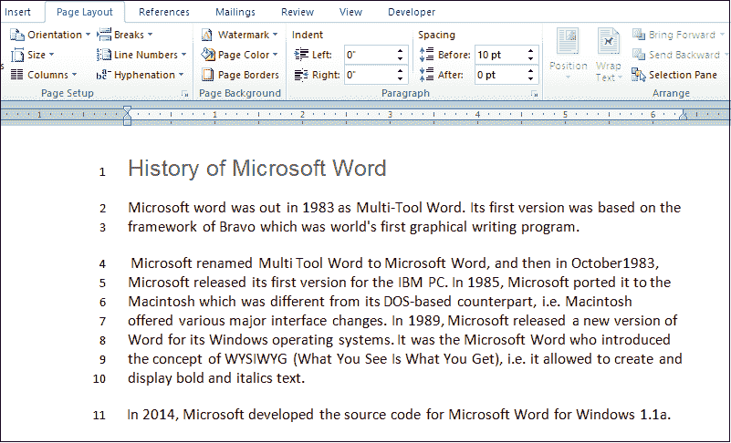

# 如何在 Microsoft Word 文档中添加或删除行号

> 原文：<https://www.javatpoint.com/how-to-add-or-remove-line-numbers-in-microsoft-word-document>

在 Word 文档中，行号用于快速识别某个段落或部分。

### 向整个文档添加行号

按照下面给出的步骤为整个 Word 文档添加行号-

**第一步:**打开要添加行号的 Word 文档。

**第二步:**转到**首页**选项卡，点击**选择**，从**编辑**部分下拉菜单中点击**全选**选项或按键盘上 **Ctrl+A** 键。

**第三步:**进入功能区的**页面布局**选项卡，点击**页面设置**部分中与**行号**选项相关的下拉菜单。

**第四步:**点击**连续**选项。

下面的截图显示行号被添加到 Word 文档中。

### 向选定文本添加行号

[微软 Word](https://www.javatpoint.com/ms-word-tutorial) 可以给选中的文本添加行号。

**第一步:**打开 Word 文档。

**第二步:选择或高亮显示**要添加行号的文本。

**第三步:**点击功能区的**页面布局**选项卡。将打开一个功能区，点击**页面设置**部分的**行号**。将出现行号下拉菜单，点击**行号**选项。

**步骤 4:** 屏幕上将出现一个页面设置窗口，在该窗口中执行以下操作:

1.  在**部分开始**字段选择**连续**。
2.  在**应用于:**字段中选择**选定文本**。
3.  点击**行号按钮**，如下图截图所示。

**第五步:**屏幕上会出现一个小的**行号**对话框。点击**添加行号**复选框，选择**连续**单选按钮，点击**确定**按钮。

**第六步:**点击**页面设置**窗口底部的**确定**按钮。

下面的屏幕截图显示，行被添加到选定的文本。

### 删除行号

您可以使用以下步骤从 Word 文档中删除行号-

**步骤 1:** 打开 Word 文档。

**第二步:高亮显示/选择**要删除行号的特定段落或整个文档。

**第三步:**进入功能区的**页面布局**选项卡，点击**页面设置**部分的**行号**。

**第四步:**屏幕上会出现一个行号下拉菜单。点击行号下拉菜单中的**无**。

#### 注意:单击当前段落的隐藏，从单个段落中删除行号。

现在，您可以看到行号已从 Word 文档中删除。

* * *