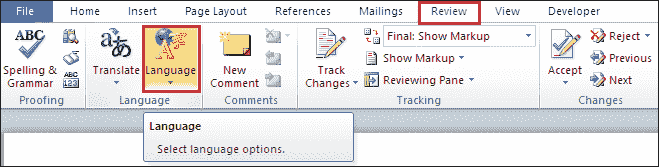
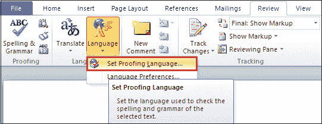
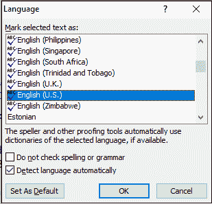
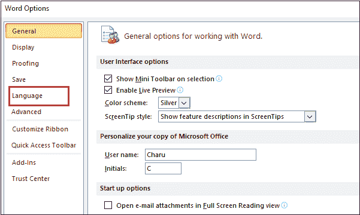
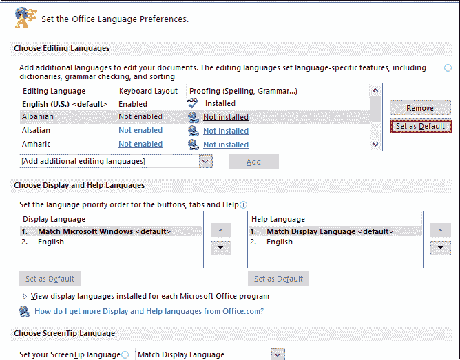
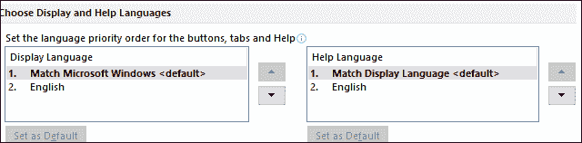

# 如何在 Microsoft Word 文档中更改语言

> 原文：<https://www.javatpoint.com/how-to-change-language-in-microsoft-word-document>

微软 Word 有一个内置工具，允许你将当前 Word 文档的语言更改为不同的语言。

有以下方法可以更改 Microsoft Word 文档中的语言-

### 方法 1:使用功能区上的“审阅”选项卡

这是用鼠标点击几下就能改变[微软 Word](https://www.javatpoint.com/ms-word-tutorial) 文档语言的最简单快捷的方法——

**步骤 1:** 打开新的或现有的 Word 文档。

**第二步:**进入功能区的**查看**选项卡，点击**语言组**中与**语言**相关的下拉图标。

**第三步:**屏幕上会出现一个小的语言下拉菜单。点击**设置校对语言**选项。

**第 4 步:**屏幕上将出现一个**语言对话框**，选择您想要的语言，点击**确定**按钮。

单击“确定”按钮后，您所需的语言将应用于您的 Microsoft Word 文档。

### 方法 2:使用窗口

按照以下步骤使用 Windows 更改语言-

**第一步:**打开微软 Word 文档。

**第二步:**转到文档左上角的**文件**选项卡。一个**文件菜单选项**将出现在点击**选项**的屏幕上。

**第三步:**屏幕上会出现一个**单词选项**对话框。点击左窗格中的**语言**选项。

**第 4 步:** A **设置办公语言首选项**窗口出现，在该窗口中**选择您要应用的语言**，点击**设置为默认**按钮。

#### 注意:在 Microsoft Word 中，如果您更改语言，它将更改所有特定于语言的功能，如语法检查、词典和拼写。

**第五步:**选择**显示和帮助语言**。

**第六步:**点击屏幕下方的**确定**按钮。“设置办公室语言首选项”窗口将关闭，您所需的语言将应用于 Word 文档。

* * *