# 如何在 Word 文档中更改页面方向

> 原文：<https://www.javatpoint.com/how-to-change-page-orientation-in-word-document>

页面方向是指页面在 Word 文档中打印或显示的方向。当 Word 文档中的内容需要图片、图形、电子表格、图表等时，使用页面方向。

在 Microsoft Word 中，有以下两种类型的页面方向可用-

**1。纵向(垂直)**

默认情况下，Word 文档是纵向的。

**2。横向(水平)**

当 Word 文档包含图像、插图或图表时，使用横向页面方向。

您可以在 Word 文档中使用以下最简单快捷的方法来更改页面方向-

### 方法 1:使用页面布局选项卡更改页面方向

在 Word 中更改页面方向要容易得多。按照以下步骤更改 Word 文档中的页面方向-

**第一步:**打开 Word 文档。

**第二步:**进入功能区的**页面布局**选项卡，点击**页面设置**组中的**方向**。

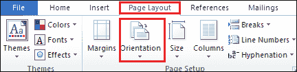

**步骤 3:** 出现一个下拉菜单，有两个选项**纵向(适用于纵向)**和**横向(适用于横向)**。根据需求选择页面方向。

#### 注意:在我们的例子中，我们将选择横向。

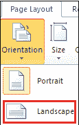

下面的屏幕截图显示页面方向(横向)应用于 Word 文档。现在，您可以轻松地在文档中添加大型表格或图表。

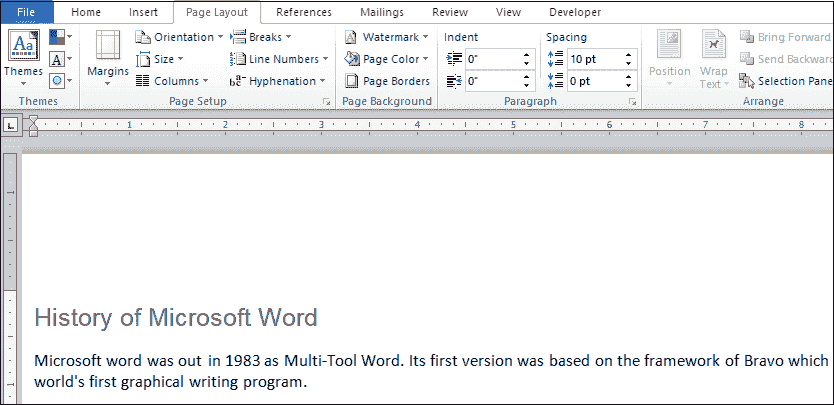

### 方法 2:更改默认页面方向

如您所知，默认 Word 文档以**纵向**模式打开，但大部分用户都希望使用横向页面方向，因此您可以将默认页面方向从纵向永久更改为横向。

按照以下说明在 Word 文档中永久更改默认页面方向-

1.打开新的 Word 文档或现有的 Word 文档。

2.转到功能区的**页面布局**选项卡，点击**页面设置**组中的**小箭头(显示页面设置对话框**)。

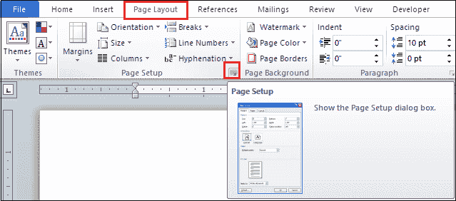

3.屏幕上将出现**页面设置对话框**。在方向部分选择方向为**风景**，点击屏幕底部的**设置为默认**按钮。

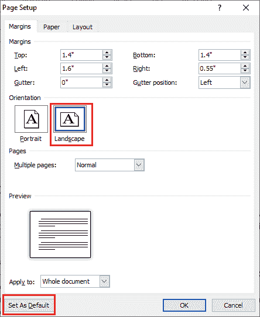

4.屏幕上会出现微软 Word 确认提示，点击**是**按钮确认更改。

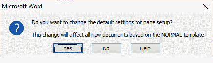

现在，您可以看到您的默认页面方向设置为横向(水平)。

#### 注意:您也可以按照相同的说明将默认方向设置为纵向。

### 方法 3:更改特定页面的页面方向

当您的 Word 文档在单个文档中同时包含横向和纵向页面方向时，将使用此方法。

更改特定页面的页面方向有以下步骤-

**步骤 1:** 打开新的 Word 文档。

**第二步:**进入功能区的**页面布局**选项卡，点击**页面设置**组中的**断点**选项。

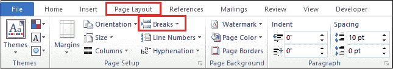

**第三步:**屏幕上将出现**分页符**对话框，点击**分页符**部分的**下一页**选项。

**第 4 步:**一旦点击下一页，这将自动在文档中插入分节符，并为新页面开始新的部分。

**第五步:**现在，在**方向**部分选择页面方向为**风景**。

**第 6 步:**再次为新页面插入分节符。现在，转到功能区上的**页面布局**选项卡。点击与方向相关的下拉菜单，从下拉菜单中选择**肖像**。

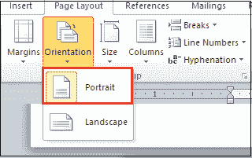

现在，您可以看到纵向和横向页面方向都应用于 Word 文档。

#### 注意:在我们的例子中，我们的 Word 文档有一个横向页面方向，而整个 Word 文档有一个纵向页面方向。

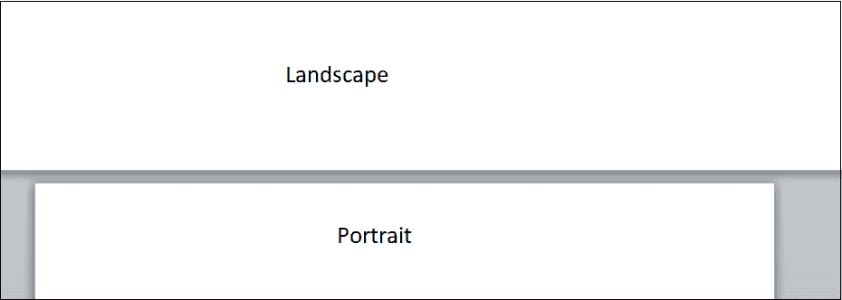

#### 注意:使用以上步骤，您可以在 Word 文档中插入多个分节符并更改页面方向。

### 方法 4:使用键盘快捷键更改页面方向

[Microsoft Word](https://www.javatpoint.com/ms-word-tutorial) 允许您使用键盘快捷键以最快最简单的方式更改页面方向。使用这种方法的优点是，它节省了您的时间，并且避免了在文档中工作时使用鼠标。

要使用键盘快捷键更改页面方向，请按照以下步骤操作-

**第一步:**打开 Word 文档。

**第二步:**按键盘上的 **Alt+P** 键到**将**从**首页**标签移动到**页面布局**标签。

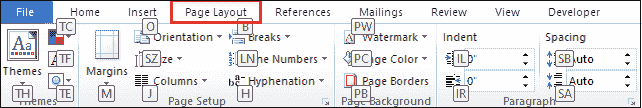

**第三步:**按键盘上的 **M** 键至**打开页边距**标签。

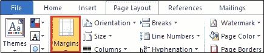

**第四步:**按 **A** 键打开**自定义边距**。

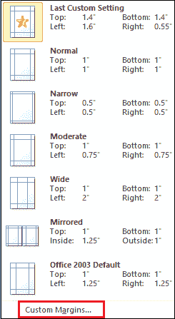

**第五步:**屏幕上将出现**页面设置**对话框。按下 **Alt + S** 键选择**横向**方向。

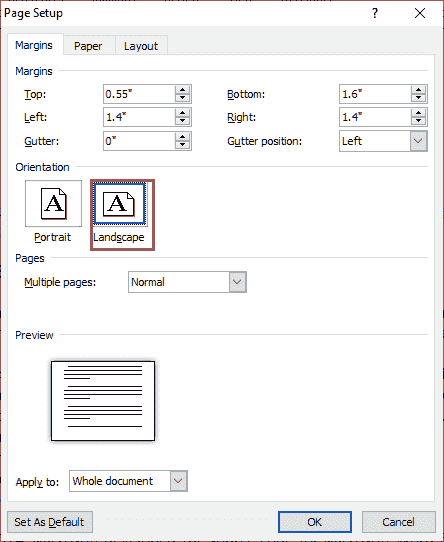

**第 6 步:**现在，按下 **Alt+Y** 键，将**应用到**选项。下拉菜单打开，选择**整份文件**，按**回车**键设置整份文件。再次按**进入**应用 Word 文档中的设置。

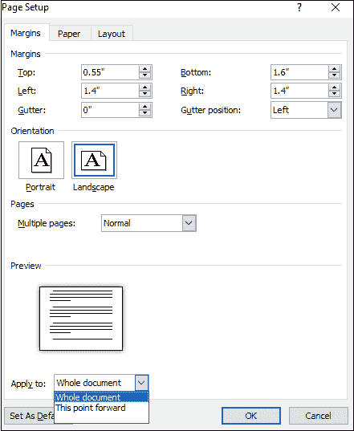

“页面设置”窗口将关闭，横向页面方向将应用于您的 Word 文档。

* * *