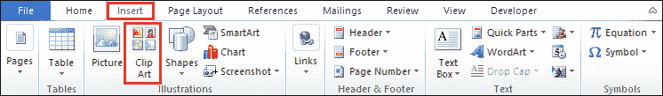

# 如何在 word 中创建徽标

> 原文:[https://www.javatpoint.com/how-to-create-a-logo-in-word](https://www.javatpoint.com/how-to-create-a-logo-in-word)

Logo 是一种**图形标记或符号**，由风格化的文本、形状、图像或三者的组合组成。它用于识别公司、组织、产品或品牌。

一个设计良好的标志可以帮助你与目标受众建立联系，并邀请他们与你的品牌互动。

## 标志的组成部分

一个精心设计和吸引人的标志包含以下组成部分-

**1。颜色**

标志中使用的吸引人的颜色组合将观众吸引到您的品牌上，并增强您的品牌传播。在徽标中，您可以根据自己的要求使用黑色、白色或多色。

**2。排版**

排版是标志最重要的组成部分之一。这是一门告诉顾客你在向观众提供什么的手艺。

**3。图像**

在徽标中，图像可以是图标或符号。它帮助用户清楚地识别品牌。

**4。标语**

标语用在标志下面。这是一句话或流行语，很容易让你的观众明白你的品牌是做什么的。

**5。正文**

文字是标识中最常用的组成部分。始终尝试在徽标中添加时尚和独特的文字。

### 在 Word 文档中创建徽标

[微软 Word](https://www.javatpoint.com/ms-word-tutorial) 提供各种时尚的文字和形状，打造好看好看的 logos。

在 Word 文档中创建徽标有以下几种方法-

### 方法 1:创建一个简单的标志

使用形状和文本框在 Word 文档中创建徽标有以下步骤-

**步骤 1:** 打开新的 Word 文档或现有的 Word 文档。

**第二步:**进入功能区的**视图**选项卡，点击**显示**组中的**网格线**复选框。

**第三步:**转到**在功能区插入**标签，点击**插图**组中的**形状**选项。

**第四步:**屏幕上会出现一个最近使用过的形状对话框。选择要添加的形状，并将其拖到当前文档中。

**第五步:**拖动文档中的形状后，屏幕上会自动出现一个**格式**标签。点击**形状样式**下的**形状填充**选项，出现**主题颜色**窗口，在该窗口中选择您想要在徽标中应用的颜色。

**步骤 6:** 要在徽标中添加文本，请转到功能区上的**插入**选项卡，然后单击**文本**组中的**文本框**图标。

**第七步:**屏幕上会出现如下窗口，点击屏幕下方的**绘制文本框**。

**第八步:**在你的形状里面画一个文本框，开始写你想添加到 logo 里面的文字。

**第 9 步:**高亮显示文本，进入功能区的**主页**选项卡。选择要应用于文本的主题字体和大小。

**第 10 步:**一旦你的标志被创建，转到功能区上的**查看**选项卡和**取消选中网格线**复选框。

下面的截图显示在 Word 文档中创建了一个简单的徽标。

### 方法 2:在 Word 文档中创建一个有吸引力的徽标

一个吸引人的标志包括形状、轮廓、艺术字、颜色和图像，以吸引客户的注意力。Microsoft Word 2007 及其最新版本在功能区上包含各种绘图工具，可帮助您创建吸引人的徽标。

要在 Word 文档中创建有吸引力的徽标，请按照以下步骤操作-

**第一步:**打开新的空白 Word 文档。

**步骤 2:插入形状**

1.  转到功能区的**插入**选项卡，点击**插图**组中的**形状**选项。
2.  屏幕上将出现一个**最近使用的形状**对话框。选择徽标中想要的图像，并将其拖到当前文档中。

**第三步:改变轮廓**

1.  要改变轮廓，点击**形状**。
2.  一个**格式**标签出现在屏幕上，点击它。
3.  转到**形状样式**中的**彩色轮廓**选项卡。选择要应用于徽标的彩色轮廓。

**第四步:改变轮廓重量**

1.  要更改形状轮廓重量，单击**形状样式**中的**形状轮廓**选项卡。
2.  屏幕上将出现**主题颜色**对话框。
3.  点击**重量**图标，屏幕上会出现一个不同大小重量的列表，根据你的要求选择重量大小，如下图截图所示。

**第五步:在 logo 中插入艺术字**

按照以下说明在 Word 2010 中插入艺术字-

1.要在徽标中插入艺术字，请转到功能区上的**文件**选项卡，然后单击**另存为**选项。

2.出现另存为对话框，点击与另存为类型相关的下拉图标，选择 **Word 97-2003 模板(*)。点)**从下拉菜单中选择。

3.以下屏幕将出现在屏幕上，点击继续按钮。

4.现在，进入**插入**标签，点击**文字**组下的**艺术字**图标。

5.出现**艺术字对话框**，根据需要选择艺术字。

6.出现**编辑艺术字文本**窗口，输入想要应用的文本，点击屏幕底部的**确定**按钮。

7.点击文本，进入**格式**标签，点击**环绕文本**图标。出现一个下拉菜单，点击文本前的**。**

**

8.根据你的要求调整文字。

下面的截图显示艺术字被添加到徽标中。

**第六步:在 logo 中插入图片**

Microsoft 允许您向徽标添加图片。

按照以下说明在徽标中插入图片。

1.转到功能区的**插入**标签，点击**插图**部分的**剪贴画**。

2.一个**剪贴画对话框**将出现在文档的右上角。在**搜索文本框**中输入图像名称，点击**进入**按钮。

对话框中会出现相关图像的列表。选择要插入徽标的图像，并将其拖到文档中。

3.点击图片。进入**格式**标签，点击**环绕文字**。出现环绕文本下拉菜单，点击【文本前面的 T4】，如下图所示。

4.根据您的形状调整图像。

5.下面的截图显示图像被插入到徽标中。

**第七步:在 logo 中添加颜色**

在 Microsoft Word 中，可以在徽标中添加颜色，使徽标更具吸引力和美观性。

1.选择要添加颜色的形状。

2.转到**格式**选项卡，在**形状样式**中选择**颜色**。

下面的截图显示，颜色被添加到徽标。

#### 注意:您可以根据自己的要求调整徽标的大小。

* * ***