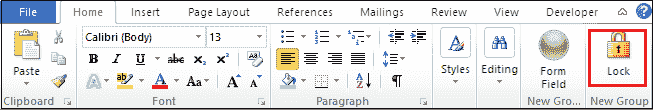

# 如何在 Word 文档中创建下拉菜单

> 原文：<https://www.javatpoint.com/how-to-create-a-drop-down-menu-in-word-document>

下拉菜单也称为**下拉列表、下拉菜单、下拉列表**或**下拉框。**用于显示选项列表，允许您根据需求从列表中选择一个选项。

在 Word 文档中创建下拉菜单有以下两种方法-

### 方法 1:使用表单域选项

按照以下最简单的步骤使用表单域选项在 Word 文档中创建下拉菜单-

**第 1 步:**打开新的 Word 文档或现有的 Word 文档，在其中创建一个下拉菜单。

**第二步:**转到文档左上角的**文件**选项卡。屏幕上将出现文件选项列表。点击**选项**标签。

**第三步:**出现**文字选项**对话框，点击左窗格**自定义功能区**，从下拉菜单选择**命令不在功能区**命令。

**第 4 步:**现在，在单词选项对话框中，按照以下说明操作-

1.  点击**插入框架**。
2.  单击右侧窗格中的**新组**。
3.  点击**添加按钮**将**插入表单域**插入主选项卡。
4.  窗格右侧增加了一个新选项**插入自字段**。

**第五步:**文档右上角增加一个**表单域**。点击**表单域**图标。

**第六步:**弹出一个小的**表单域**窗口。点击与**下拉菜单**相关的单选按钮，然后点击**确定**按钮。

**第七步:**出现一个小方框方盒，双击即可。

**第八步:**点击该框后，屏幕上会出现下拉表单域选项对话框，在该对话框中执行以下操作-

1.在**下拉项目文本框**中输入项目，点击**添加**按钮，在下拉列表的项目中插入一个项目。

#### 注意:使用以上步骤，您可以在下拉列表中添加多个项目。

2.勾选**下拉启用复选框**。

3.点击**确定**按钮，如下图截图所示。

**第九步:**一旦创建了下拉列表，现在就需要锁定下拉列表。要启用锁定，转到**文件- >选项- >自定义功能区**并从**下拉菜单中选择**不在功能区的命令**选择命令。**

**第十步:**点击**锁定- >新组- >添加**，主选项卡会出现锁定图标，如下图截图所示。

**第 11 步:**现在可以看到**锁定**图标会出现在屏幕右上角，点击**锁定**图标。

单击锁定后，屏幕上会出现一个下拉图标。单击下拉箭头。您可以看到您插入的项目将出现在下拉列表中。

### 方法 2:启用开发人员选项卡

要使用“开发人员”选项卡在 Word 中创建下拉列表，请按照下列步骤操作-

**步骤 1:** 打开新的 Word 文档或现有的 Word 文档。

**步骤 2:** 转到功能区的**文件**选项卡。屏幕上将出现文件选项列表，点击**选项**。

**第三步:**屏幕上会出现一个**单词选项对话框**。点击**定制功能区**并勾选主选项卡中的**开发者复选框**。

#### 注意:在 Microsoft Word 2019 和 Office 365 中，“开发人员”选项卡将出现在功能区上。

**步骤 4:** 现在，开发人员选项卡将出现在功能区上。点击开发者选项卡，在**控件部分**选择**下拉列表内容控件**。

**第五步:** A **选择一个项目**框将出现在当前文档中。要在下拉列表中添加项目，单击**控件**部分中的**属性**。

**步骤 6:** 屏幕上将出现一个**内容控制属性**对话框，在该对话框中执行以下操作。

1.  **在**标题框**中输入下拉列表的名称**。
2.  点击**添加按钮**在列表中添加项目。出现**添加选择窗口**，输入**显示名称**和**值**。
3.  点击屏幕底部的**确定**按钮。

下面的截图显示在 Word 文档中创建了一个下拉列表。

* * *