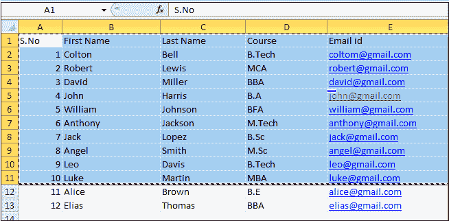
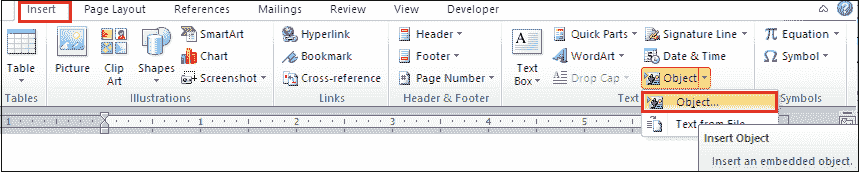
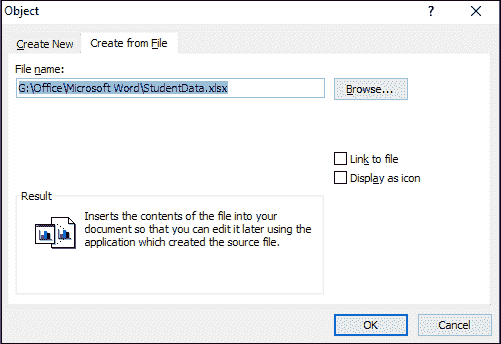
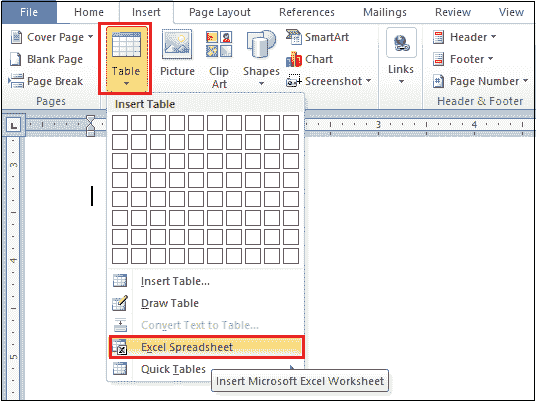
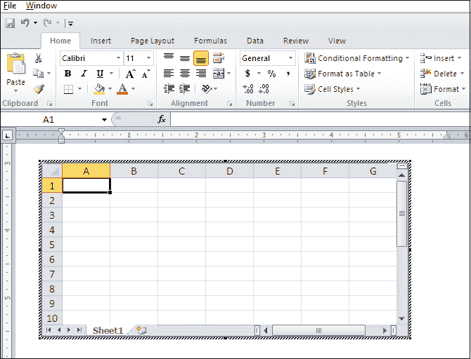

# 如何将 Excel 电子表格插入 Word 文档

> 原文:[https://www . javatpoint . com/如何将 excel 电子表格插入到 word 文档中](https://www.javatpoint.com/how-to-insert-an-excel-spreadsheet-into-a-word-document)

众所周知，微软 Office 是微软的一款软件产品，所以它允许你做各种各样的任务，包括**上交会计账簿**、**添加图形或饼图**、**将 excel 数据插入 Word** 等，还有一些更多的任务。

在[微软 Word](https://www.javatpoint.com/ms-word-tutorial) 中，可以按照以下方法将 Excel 电子表格插入 Word 文档-

**方法 1:使用复制/粘贴**

复制/粘贴是一种将 Excel 数据插入 Word 文档的快速简便的方法。

1.打开 Excel 工作表，**高亮显示要移动到 Word 文档的单元格**。按下键盘上的 **Ctrl+A** 键，高亮显示电子表格中的所有单元格。

**2。右键单击文档上的**，然后单击复制按钮或按下 **Ctrl+C** 键**复制高亮显示的数据。**

3.打开 Word 文档，**将光标**放在要复制 Excel 数据的文档中。

**4。右键点击文档上的**，点击**粘贴**选项，也可以直接从键盘上按下 **Ctrl+V** 键，将数据高亮显示的数据粘贴到 Word 文档中。

下面的截图显示 Excel 电子表格数据被插入到 Word 文档中。

### 方法 2:使用插入对象

在这种方法中，可以使用**插入选项卡**将 Excel 电子表格数据插入到 Word 文档中。

**第一步:**打开 Word 文档。

**第二步:**进入功能区**插入**选项卡，点击**对象**下拉菜单，在**文本**部分选择**对象**。

**第三步:**屏幕上将出现**对象对话框**。从文件选项卡点击**创建** **，浏览要插入的 excel 文件。一旦选定的文件位置出现在对象对话框中，点击屏幕底部的**确定**按钮。**

在对象对话框中，您将看到两个复选框:**链接到文件并显示为图标**。

*   如果要将 Excel 电子表格与 Word 文档链接，请单击“链接到文件”复选框。
*   如果要将 Excel 电子表格显示为图标，请单击显示为图标复选框。

#### 注意:在我们的例子中，我们只想将 excel 电子表格数据插入到 Word 文档中，所以我们不使用任何复选框。

下面的截图显示 Excel 电子表格数据被插入到 Word 文档中。

### 方法 3:使用表格选项将 Excel 电子表格插入 Word 文档

**步骤 1:** 打开 Word 文档。

**第二步:**将光标放在要插入 Excel 表格的文档中。

**第三步:**进入功能区的**插入**选项卡，点击**表格**选项。屏幕上将出现**插入表格**对话框。点击 **Excel 电子表格**，如下图截图所示。

下面的截图显示 Excel 电子表格被插入到 Word 文档中。

#### 注意:您可以根据需要更改电子表格的大小和单元格。

* * *