# 如何在 Microsoft Word 文档中向表格添加行和列

> 原文:[https://www . javatpoint . com/如何在 Microsoft word 文档中向表格添加行和列](https://www.javatpoint.com/how-to-add-a-row-and-column-to-a-table-in-microsoft-word-document)

要向表格中添加单元格、行和列，首先需要在 Word 文档中创建表格。

### 创建表格

表格是行、列和单元格的组合。在 Word 文档中，表格用于以更好的方式组织和呈现信息。

#### 注意:单元格是行和列的组合。

按照以下说明在 Word 文档中添加表格-

1.打开新的或现有的 Word 文档。

2.将光标放在文档中要插入表格的位置。

3.转到功能区的**插入选项卡**，点击**表格**组中的**表格**选项。

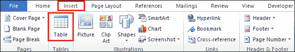

4.屏幕上将出现**插入表格**对话框。根据需要选择**的行数和列数**。

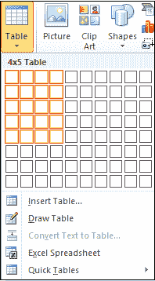

#### 注意:在我们的例子中，我们选择了四行五列。

5.按键盘上的回车键或单击创建表格。

下面的屏幕截图显示，在 Word 文档中插入了一个包含行和列的表格。

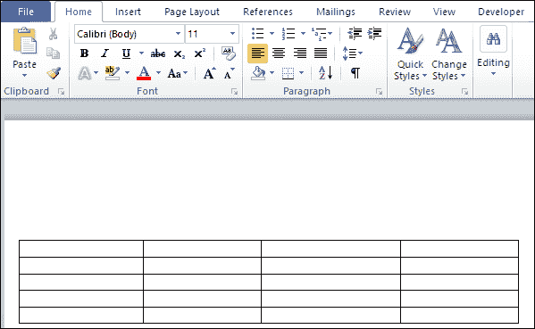

### 在表格上方或下方添加一行

在 Word 文档中创建表格后，可以根据需要在表格中添加其他行。

按照下面的简单步骤在表中添加一行-

**步骤 1:** 将光标放在要添加行的表格中。

**第二步:在选中区域右键**，屏幕上会出现如下对话框。点击与插入按钮相关的**下拉菜单。**

*   点击**在**上方插入行选项**在**上方添加一行所选行。
*   点击**在**下方插入行选项**在**下方添加一行所选行。

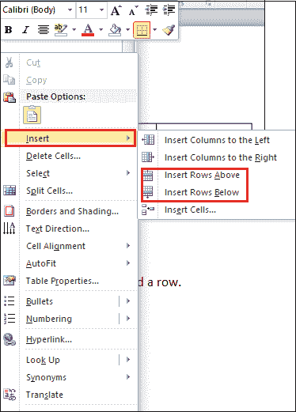

下面的截图显示了一个新的行被添加到表格中。

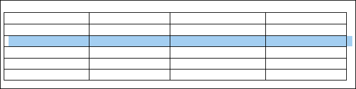

**从表格中删除一行**

1.将光标放在要从表中删除的行中。

2.**右键点击选中行的**，屏幕上会出现一个选项列表。点击**删除单元格**。

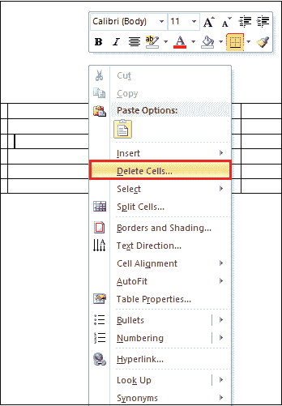

3.屏幕上会出现一个小的**删除单元格**对话框。点击**删除整行**单选按钮，然后点击**确定**。

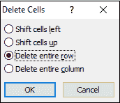

现在，您可以看到您选择的行已从表中删除。

### 向表中添加一列

在 Word 文档中添加额外的列对您来说并不是一项困难的任务。按照下面提到的步骤向表中添加一列。

**步骤 1:** 将光标放在要添加列的表格中。

**第二步:右键点击表格上的**，屏幕上会出现一个选项列表点击与插入相关的下拉图标。

*   点击**在左侧插入列**在表格左侧添加列**。**
*   点击**在右侧插入列**以在表格右侧添加列**。**

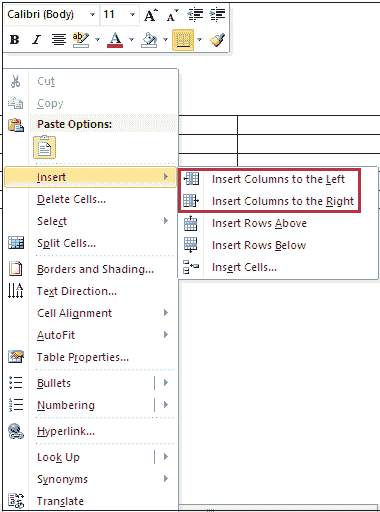

下面的截图显示该列被添加到表格中。

#### 注意:在我们的例子中，我们希望将表插入到所选列的右侧，所以我们使用“将列插入到右侧”选项。

### 从表中删除一列。

在 [Microsoft Word](https://www.javatpoint.com/ms-word-tutorial) 文档中，按照以下说明从表格中删除不必要的列。

1.将光标放在要删除的列中。

2.**右键点击表格上的**，出现选项列表，点击**删除单元格**。

3.出现**删除单元格**对话框，点击**删除整列**单选按钮。

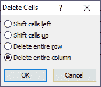

现在，您可以看到选定的列已从表中删除。

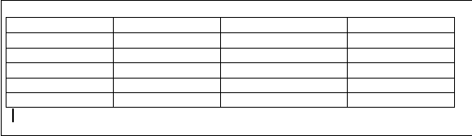

### 添加单元格

单元格是行和列的组合。

您可以使用以下步骤向表格中添加单元格-

**步骤 1:** 将光标放在表格中要插入单元格的位置。

**第二步:右键点击表格上的**，屏幕上会出现一个选项列表点击与插入相关的下拉图标。

**第三步:**点击**插入单元格**选项。

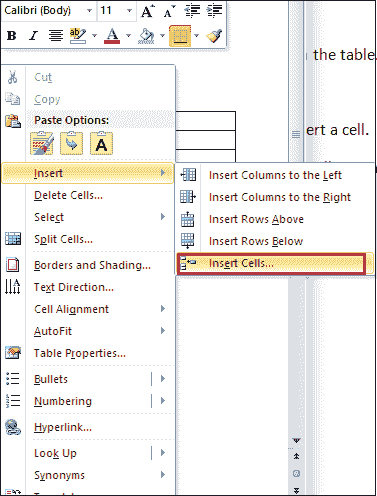

**第四步:**屏幕上将出现**插入单元格**对话框。点击**下移单元格**单选按钮，点击**确定**按钮。

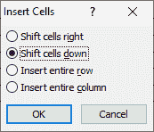

下面的截图显示一个新的单元格被添加到表格中。

* * *