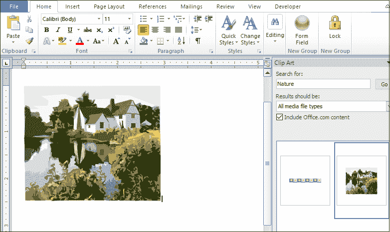

# 如何向 Word 文档添加剪贴画

> 原文：<https://www.javatpoint.com/how-to-add-clip-art-to-word-document>

剪贴画是指可以插入到 Word 文档中的**图形或图片**。单击艺术包含各种不同的格式和样式，以增强 Word 文档的外观。

将剪贴画添加到 Word 文档有以下步骤-

#### 注意:在我们的示例中，我们将使用 Microsoft 2010 向 Word 文档添加剪贴画-

**步骤 1:** 打开新的或现有的 Word 文档。

**第二步:**将光标放在文档中要添加剪贴画的位置

**第三步:**进入功能区的**插入标签**，点击**插图**组中的**剪贴画**选项。

#### 注意:在 Microsoft Word 2013 和 2016 中，剪贴画选项称为“在线图片”。

**第四步:**文档的右上角会出现一个**剪贴画对话框**。**在**文本框中输入图像名称**搜索:**并点击**转到**按钮。

将出现相关图像的列表。选择要添加到 Word 文档中的图像。

下面的屏幕截图显示您选择的剪贴画已添加到 Word 文档中。

### 在 Word 文档中插入图片

在[微软 Word](https://www.javatpoint.com/ms-word-tutorial) 中，还可以从自己的内存条中插入文档中的图片。插入图片使 Word 文档更有吸引力和好看。

按照以下步骤在 Word 文档中插入图像-

**步骤 1:** 打开新的或现有的 Word 文档。

**步骤 2:** 将光标放在文档中要插入图像的位置。

**步骤 3:** 转到功能区的**插入**标签。点击**插图**部分的**图片**选项。

**第四步:**屏幕上将出现**插入图像对话框**。**浏览并选择**您想要插入到文档中的图片，点击屏幕底部的**插入**按钮。

现在，您可以看到您想要的图片被添加到 Word 文档中。

* * *