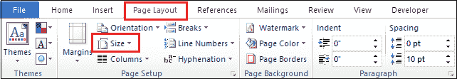
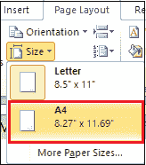
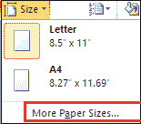
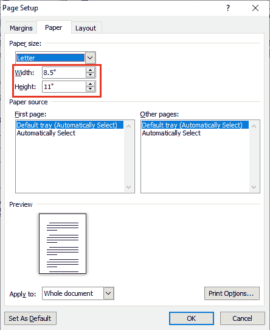

# 如何在 Word 文档中更改纸张大小

> 原文：<https://www.javatpoint.com/how-to-change-paper-size-in-the-word-document>

在 Microsoft Word 中，您可以更改文档中特定页面或特定部分的纸张大小。

#### 注意:在 Microsoft Word 中，默认页面大小为 8.5±11 英寸。

### 1.将纸张尺寸改为 A4

按照以下步骤更改特定部分的纸张尺寸-

**步骤 1:** 在 Word 文档中打开一个新的或现有的文件。

**第 2 步:**高亮显示页面上要更改的文本。

**第三步:**点击功能区的**页面布局**选项卡，点击**页面设置**组中与**尺寸**相关的下拉菜单。

**第 4 步:**点击**尺寸**下拉菜单中的 **A4** 选项。

现在，您可以看到您的默认纸张大小更改为 A4 大小。

### 更改自定义页面大小

[微软 Word](https://www.javatpoint.com/ms-word-tutorial) 允许你根据自己的需求改变页面大小。按照以下步骤更改 Word 文档中的页面大小

**步骤 1:** 打开新的或现有的 Word 文档。

**第二步:**进入功能区的**页面布局**选项卡，点击**页面设置**组中与**尺寸**选项相关的下拉菜单。

**步骤 3:** 从尺寸下拉菜单中点击**更多页面尺寸**。

**第四步:**屏幕上将出现**页面设置对话框**。在纸张尺寸部分输入**宽度和高度**。点击页面设置对话框底部的**确定**按钮。

现在，您可以看到页面大小根据您的需求而改变。

* * *