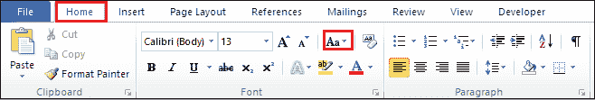
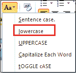
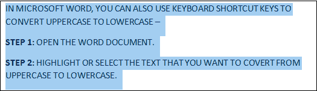
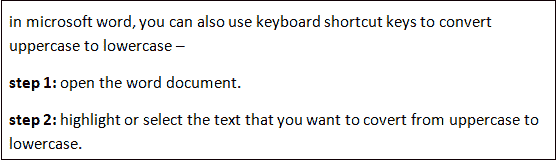
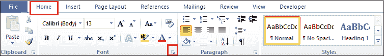
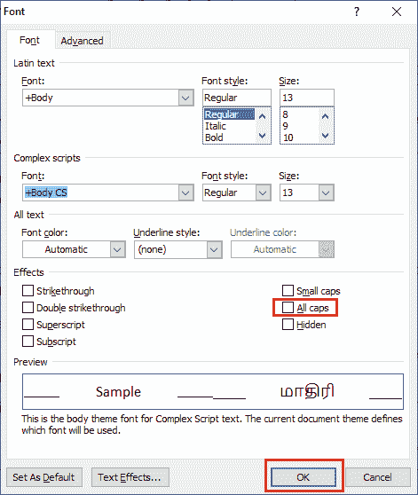

# 如何在 Microsoft Word 文档中将大写转换为小写

> 原文：<https://www.javatpoint.com/how-to-convert-uppercase-to-lowercase-in-microsoft-word-document>

按照以下步骤将 Microsoft Word 文档中的大写字母转换为小写字母-

### 方法 1:使用变更案例图标

[微软 Word](https://www.javatpoint.com/ms-word-tutorial) 包含一个改变大小写的功能，可以让你轻松地将大写字母转换成小写字母或者将小写字母转换成大写字母。

**第 1 步:**打开要将大写转换为小写的 Word 文档。

**步骤 2:** 选择或高亮显示文本。

**第三步:**进入功能区的**首页**选项卡，点击**字体**部分的**改案**图标，进入**改案**下拉菜单。

**第 4 步:**将出现变更案例下拉菜单，选项如下-

**句格:**用于每个句子的首字母大写。

**小写:**用于将文字从大写改为小写。

**大写:**用于将文字从小写转换为大写。

**每个单词大写**:用来大写每个单词的第一个字母。

**切换大小写:**用于在两个视图之间切换，例如在大写每个单词和大写每个单词之间切换。

#### 注意:在我们的例子中，我们将使用小写选项。

#### 注意:如果您想将小写转换为大写，请从“更改大小写”下拉菜单中单击“大写”选项。

一旦你这样做了，你可以看到你的大写转换成小写。

### 方法:2 使用键盘快捷键(Shift + F3)

在 Microsoft word 中，还可以使用键盘快捷键将大写字母转换为小写字母-

**第一步:**打开 word 文档。

**步骤 2:** 高亮显示或选择要从大写转换为小写的文本。

**第三步:**按住键盘上的 **Shift + F3** 键。

**第四步:**一旦放开按键，可以看到大写转换成小写，如下图截图所示。

#### 注意:使用 Shift + F3 键，您也可以在 Word 文档中将小写字母转换为大写字母。

### 方法 3:使用字体对话框

按照以下说明使用字体对话框将小写转换为大写-

1.选择要从小写转换为大写的文本。

2.转到功能区的**主页**选项卡，点击**字体**部分的**字体**对话框。

3.屏幕上会出现**字体对话框**。点击**全大写**复选框，然后点击**字体**对话框底部的**确定**按钮。

现在，您可以看到所有小写字母都转换为大写字母。

* * *