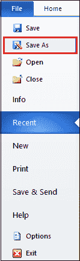
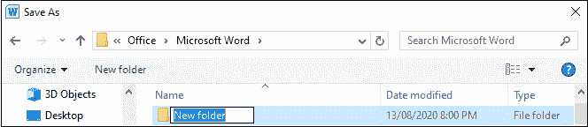
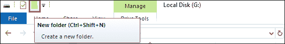

# 如何在 Word 文档中创建文件夹

> 原文:[https://www . javatpoint . com/如何在 word 文档中创建文件夹](https://www.javatpoint.com/how-to-create-a-folder-in-a-word-document)

文件夹用于将相关文档存储在计算机驱动器的单一位置。当您在当前的 Word 文档中工作时，Microsoft Word 允许您创建一个新文件夹。

#### 注意:使用以下步骤，您可以在 Microsoft Word 2007、2010、2013、2016 和 2019 中创建文件夹。

在 Microsoft Word 中，可以使用以下两种方法创建文件夹-

### 方法 1:使用另存为对话框

[微软 Word](https://www.javatpoint.com/ms-word-tutorial) 允许您使用另存为对话框创建文件夹。按照下面提到的最简单的步骤创建文件夹。

**步骤 1:** 打开新的或现有的 Word 文档。

**第二步:**点击文档左上角的**文件**标签。将出现文件选项列表，点击**另存为**选项。

**第三步:**屏幕上将出现**另存为对话框**。**浏览想要创建文件夹的位置**，点击**新建文件夹**按钮，如下图截图所示。

**第四步:输入新文件夹的名称**，按键盘上的**回车**键。

#### 注意:在文件夹名称中，不能使用斜线、冒号、分号、破折号和其他特殊字符。

**第五步:**点击**打开**按钮打开新文件夹。

**步骤 6:** 点击**保存**按钮，将您的文档保存到新创建的文件夹中。

### 方法 2:使用文件资源管理器在 Word 文档中创建新文件夹

按照以下步骤使用文件资源管理器创建新文件夹-

**第一步:**通过按键盘上的**窗口标志+ E** 键打开文件浏览器。

**第二步:浏览想要创建文件夹的位置**。从键盘上按下 **Ctrl + Shift + N** 键或点击**新建文件夹**选项，如下图截图所示。

**第三步:输入想要创建的文件夹名称**，按键盘上的**回车**键。

### 将文档保存在新创建的文件夹中

创建新文件夹后，还可以将当前 Word 文档保存在新创建的文件夹中。

按照以下步骤将您的文档保存到新创建的文件夹中-

1.  打开新的 Word 文档。
2.  点击屏幕左上角的**文件**选项卡，屏幕上会出现文件选项列表。点击**另存为**选项。
3.  浏览您的新文件夹位置。点击文件夹。在**文件名文本框**中输入您的文档名称，点击屏幕底部的**保存**按钮。

现在，您可以看到当前文档保存在新创建的文件夹中。

* * *