# 如何在 Word 文档中创建模板

> 原文：<https://www.javatpoint.com/how-to-create-a-template-in-word-document>

模板是一个预先创建的文档，其中包括一些已经创建的特定格式选项，例如**宏、页眉&页脚、自定义词典、布局、图像和自动图文集条目**。

创建内容和结构相似的文档时，模板可以帮助您节省时间。

### 在 Word 文档中创建模板

按照下面提到的最简单的步骤在 Word 文档中创建模板-

#### 注意:使用以下步骤，您可以在 Word 2010、2013、2016、2019 和 Microsoft Office 365 中创建模板。

**步骤 1:** 打开 Word 文档。

**第二步:**进入功能区的**文件**选项卡，点击**新建**选项。

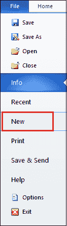

**第三步:**点击**空白单据**。

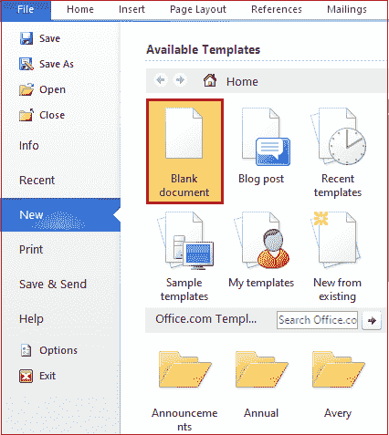

**第四步:添加想要的内容**，进一步用作模板。

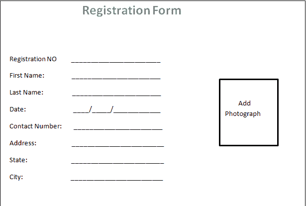

### 保存 Microsoft Word 模板

一旦你在[微软 Word](https://www.javatpoint.com/ms-word-tutorial) 中创建了模板，你就可以保存它供你进一步使用。

在微软 Word 中，可以将微软 Word 模板保存为**。dotx，。点，或者。dotm 文件格式**。

要将模板保存在 Microsoft Word 中，请按照以下说明操作-

1.打开在其中创建模板的 Word 文档。

2.转到功能区上的**文件**选项卡。屏幕上将出现一个选项列表，点击**另存为**。

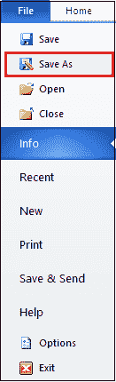

**3。浏览想要保存文件的位置**。点击下拉关联**将**另存为类型。选择**单词模板(*。dotx)** 并点击屏幕下方的**保存**按钮。

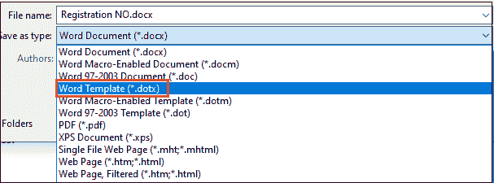

现在，您可以看到您的 Word 模板保存在 Word 文档中。

### 编辑单词模板

在 Microsoft Word 中创建模板后，您还可以根据自己的需求对其进行编辑，然后将其保存到即将发布的类似 Word 文档中。

编辑单词模板有以下最简单的步骤-

**第一步:**转到 Word 文档左上角的**文件**选项卡，点击**打开**按钮。

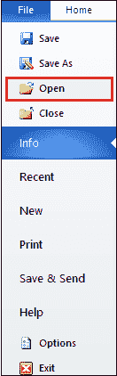

**第二步:**屏幕上会出现一个**打开对话框**。**浏览保存先前创建的模板的位置**，点击屏幕底部的**打开**按钮。

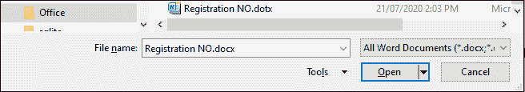

**第 3 步:**进行想要添加到模板中的更改。

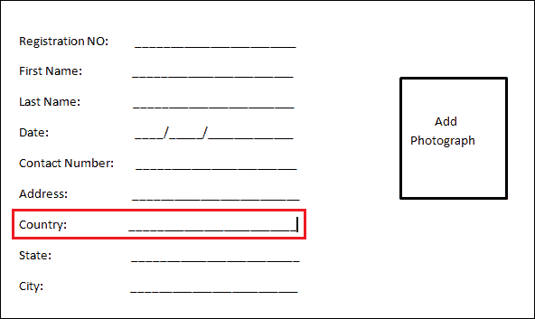

#### 注意:在我们的案例中，我们将在我们的注册表单模板中添加一个国家选项。

**第 4 步:**一旦在模板中进行了所有想要的更改，就可以保存模板并关闭它。

#### 注意:要保存模板，请按照保存 Microsoft Word 模板中提到的步骤操作。

### 使用 Microsoft Word 模板

Microsoft Word 还提供了内置的 Word 模板，您可以在 Word 文档中使用。

使用微软 Word 模板有以下步骤-

**步骤 1:** 打开新的 Word 文档。

**步骤 2:** 转到功能区的**文件**选项卡。屏幕上将出现文件菜单选项。点击**新增**。

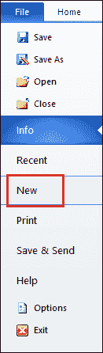

**步骤 3:** 出现可用模板窗口。点击**个人**。

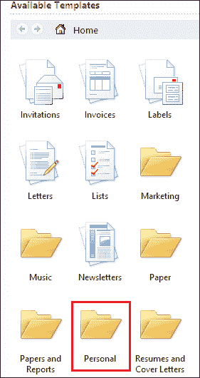

**第 4 步:**屏幕上出现 Word 模板列表。选择并双击要应用的模板。

现在，您可以看到所选模板已添加到 Word 文档中。

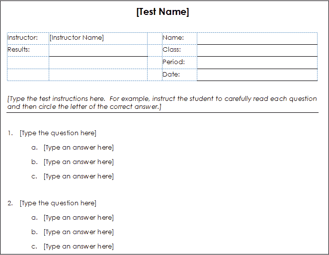

#### 注意:要保存 Word 模板，请按照保存 Microsoft Word 模板中提到的步骤操作；要编辑文档，请按照编辑 Word 模板中提到的步骤操作。

* * *