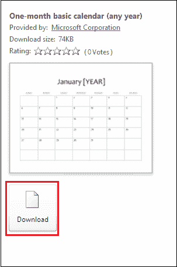

# 如何在 Word 文档中插入日历

> 原文：<https://www.javatpoint.com/how-to-insert-a-calendar-in-word-document>

日历是一种**表、图表、装置或系统**，用于显示特定年份的**日、周、月和事件**的数字。

要在[微软 Word](https://www.javatpoint.com/ms-word-tutorial) 中插入日历，请遵循下面提到的最简单快捷的方法。

### 方法 1:使用单词模板

按照以下最简单的步骤使用 Word 模板在 Word 文档中插入日历-

**步骤 1:** 打开新的或现有的 Word 文档。

**第二步:**转到文档左上角的**文件**选项卡。屏幕上将出现文件选项列表。点击**新增**。

**第三步:**屏幕上将出现一个**可用模板**窗口，在其中搜索**日历**。找到日历后，点击它。

**第 4 步:**屏幕上将出现可用模板列表。根据您的要求选择日历。

**第五步:**选择好想要的日历后，点击**下载**按钮。

下面的截图显示了一个日历被插入到 Word 文档中。

### 方法 2:使用快速表格选项

在 Microsoft Word 中，您还可以使用以下最简单的步骤手动创建日历-

**步骤 1:** 打开新的 Word 文档。

**步骤 2:** 将光标放在要创建日历的文档中。

**第三步:**转到功能区的**插入**选项卡，点击**表格**部分的**表格**选项。

**第四步:屏幕上将出现一个插入标签对话框**。点击**快捷表格**。

**第五步:**屏幕出现**内置**窗口。根据您的需求选择日历。

下面的截图显示日历被插入到 Word 文档中。

### 方法 3:手动创建日历

在 Word 文档中手动创建日历有以下步骤-

**步骤 1:** 打开要插入日历的新的或现有的 Word 文档。

**步骤 2:** 转到功能区的**插入**标签。功能区下方将打开一个插入工具栏窗口。点击**表格**部分的**表格**选项。

**第三步:**屏幕上将出现**插入表格对话框**。根据您的要求选择行数和列数，然后按键盘上的回车键。

#### 注意:在我们的例子中，我们将使用一个七乘五(7*5)大小的表格来创建日历。

**第四步:**在行首输入一周的天数名称，如**日、周一、周二、周三等**。展开日历的“全部”框，使日历形状完美。要查看日历的初始布局，请考虑下面的截图。

**第五步:**开始将方框中的数字相加，从方框中开始你一个月的第一天。要在日历中添加数字，您可以使用键盘上的数字键。

**步骤 6:** 一旦成功创建日历，您就可以将其保存在所需的位置。

### 莎瓦日历

要保存日历，转到屏幕左上角的**文件**选项卡。屏幕上将出现文件选项列表。点击**另存为**按钮。

出现**另存为对话框**，**浏览要保存文件的位置**。找到位置后，点击屏幕底部的**保存**按钮。

现在，您可以看到您的日历保存在您想要的位置。

* * *