# 如何在微软 Word 文档中绘制文本曲线

> 原文:[https://www . javatpoint . com/how-to-curve-text-in-Microsoft-word-document](https://www.javatpoint.com/how-to-curve-text-in-microsoft-word-document)

当您在 Word 文档中设计**传单、简讯**和**徽标**时，会使用弯曲文本。

您可以使用以下两种方法来弯曲 Word 文档中的文本-

### 方法 1:使用艺术字绘制文本

在[微软 Word](https://www.javatpoint.com/ms-word-tutorial) 中，可以使用**艺术字**配合**变换文字效果选项**在 Word 文档中创建时尚美观的曲线文字。

按照以下最简单的步骤在 Microsoft Word 文档中弯曲**曲线、**和**环绕文字**

#### 注意:使用以下步骤，您可以在 Microsoft Word 2013、Word 2016、Word 2019 和 Microsoft Office 365 中绘制文本曲线。

**步骤 1:** 打开新的或现有的 Word 文档。

**第二步:**高亮显示或选择想要弯曲的文本。

**步骤 3:** 转到功能区的**插入**选项卡，点击**文本**部分的**艺术字**图标。

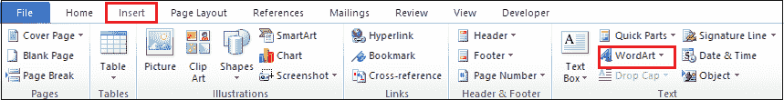

**第 4 步:**将出现艺术字列表。选择要应用于文本的字母样式(**艺术字**)。

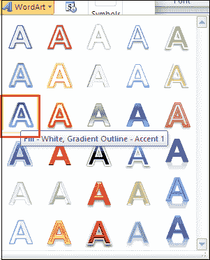

#### 注意:根据 Microsoft Word 版本的不同，艺术字可能会有所不同。

**第五步:**一旦在文本中添加了艺术字，就会自动创建一个新的菜单绘图工具。现在，转到功能区上的**表单** t 选项卡，并单击艺术字样式部分中与**文本效果**相关联的下拉图标。

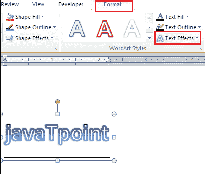

#### 注意:确保选择了“格式”选项卡。

**第 6 步:**点击**文本效果**下拉菜单中的**变换**选项。选择要在选定文本中应用的曲线。

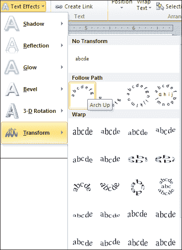

#### 注意:在我们的例子中，我们将选择向上拱曲线。

下面的截图显示一条曲线被应用于 Word 文档。

### 方法 2:不使用艺术字的曲线文本

微软 Word 允许你在不使用艺术字的情况下弯曲文本。

**第一步:**打开 Word 文档。

**第二步:**点击功能区的**插入**标签。单击文本部分中与**文本框**相关的下拉菜单。

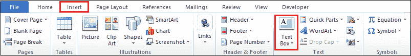

**第三步:**屏幕上会出现一个**内置的**对话框。点击**绘制文本框**选项。

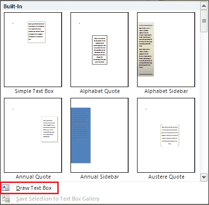

**第四步:**画一个文本框。右键单击文本框，将出现一个选项列表。单击列表中的**格式形状**选项。

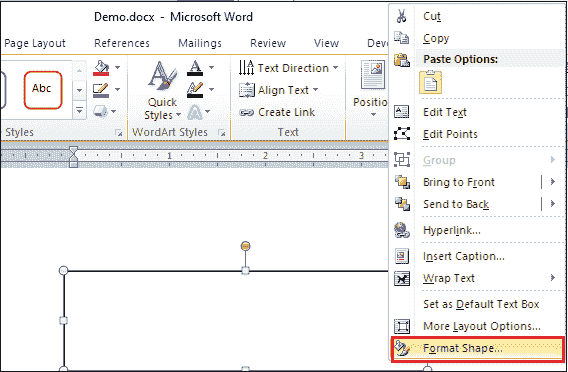

**第五步:**屏幕上将出现一个**格式形状对话框**，在左侧窗格中选择**填充选项**。点击**填充部分**中的**无填充**单选按钮。

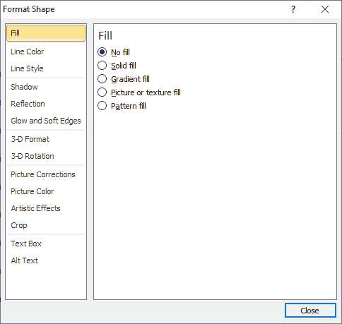

**第 6 步:**在文本框内输入想要弯曲的文本。

**第 7 步:**选择文本。转到功能区的**格式**选项卡，点击**文本努力**下拉图标。从下拉列表中选择**变换**选项，并选择要应用于 Word 文档的**弯曲文本**。

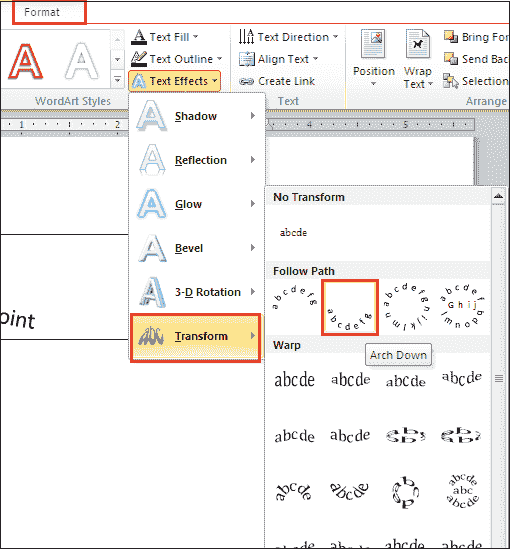

#### 注意 1:确保选择了“格式”选项卡。

#### 注 2:在我们的例子中，我们将使用向下拱文本曲线。

下面的截图显示，曲线被添加到文本中，而没有使用艺术字选项。

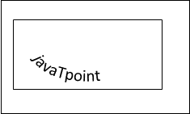

### 如何删除弯曲文本

在 Microsoft Word 中，您可以在不删除文本的情况下从文本中移除曲线。

删除弯曲的文本有以下步骤-

**第 1 步:**选择或高亮显示要移除的弯曲文本。

**第二步:**点击**艺术字样式**部分的**文字效果**下拉菜单。

**步骤 3:** 从文本效果下拉菜单中选择**变换**选项。屏幕上会出现一个选项列表，点击**无变换**，如下图所示。

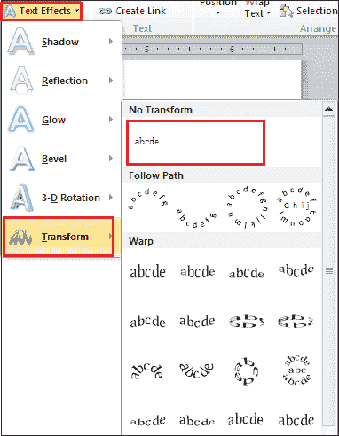

现在，您可以看到曲线从文本中移除，但没有删除文本。

* * *