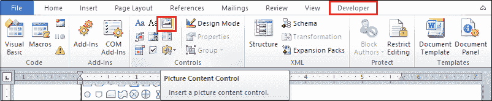

# 如何在 Word 文档中插入占位符

> 原文:[https://www . javatpoint . com/如何在 word 文档中插入占位符](https://www.javatpoint.com/how-to-insert-a-placeholder-in-word-document)

占位符也称为**伪文本**或**填充文本**。它是一个字符、单词或字符串，暂时保存最终数据的位置。

**示例:**下图截图中，**邮箱或电话**为占位符。

## 在单词中创建占位符

### 方法 1:使用功能区上的“参照”选项卡

按照以下步骤在[单词](https://www.javatpoint.com/ms-word-tutorial)文档中创建一个占位符-

**步骤 1:** 打开新的或现有的 Word 文档。

**第 2 步:**将光标放在文档中要插入占位符的位置。

**第三步:**转到功能区的**参考资料选项卡**，点击**参考资料&参考资料**部分的**插入参考资料**下拉菜单。

**步骤 4:** 点击下拉菜单中的**添加新占位符**选项。

#### 注意:在这种方法中，我们在 Word 文档中添加引用占位符。

**第五步:**屏幕上会出现一个小的占位符名称对话框。输入要插入的占位符，点击**确定**按钮插入引文占位符。

下面的屏幕截图显示占位符被插入到 Word 文档中。

### 方法 2:在 Word 文档中插入图像占位符

按照以下步骤在 Word 文档中插入图像占位符-

#### 注意 1:确保在功能区上可以看到“开发人员”选项卡。

#### 注 2:如果“开发人员”选项卡在功能区上不可见，请转到“文件”->“选项”->“自定义功能区”->“主选项卡”部分的“开发人员”复选框，然后单击屏幕底部的“确定”按钮。

**第一步:**打开 Word 文档。

**步骤 2:** 将光标放在文档中要插入图像占位符的位置。

**第三步:**转到功能区的**插入**选项卡，点击**表格**组中的**表格**选项。

**第 4 步:**屏幕上将出现“插入表格”对话框。从表格对话框中选择单个**行和列(1 个表格)**。

**第五步:**根据你的要求调整桌子的长度和宽度。

**第六步:**将光标放在表格内，点击功能区上的**开发者选项卡**，点击**控件**部分的**图片内容控件**选项。

**第 7 步:**在表格内部添加一个图片内容控件(图像占位符)。根据您的要求调整图片内容的大小。

**第 8 步:**要在占位符中插入图像，请单击图像图标的中心。浏览要插入的图像，然后单击屏幕底部的“插入”按钮。

下面的截图显示所选图像被插入占位符中。

### 更改占位符图片

要更改占位符图像，点击图像选择图像，点击**更改图片图标**，如下图截图所示。

* * *