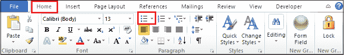
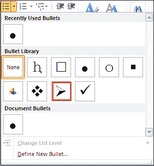
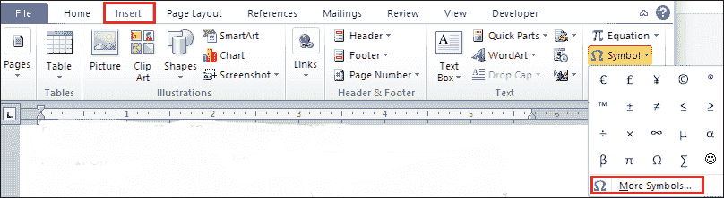
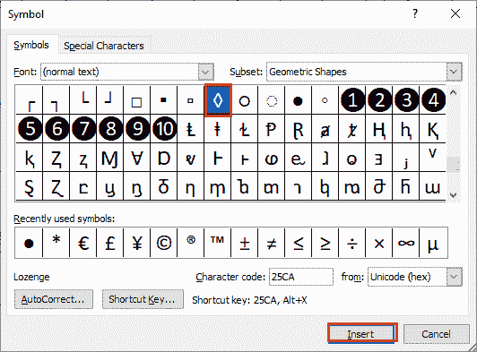
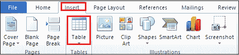
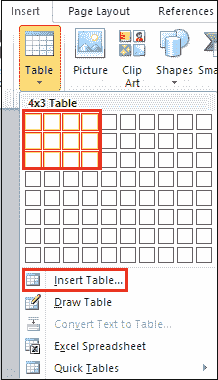
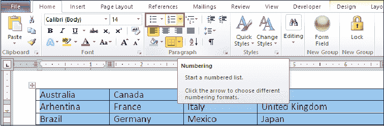
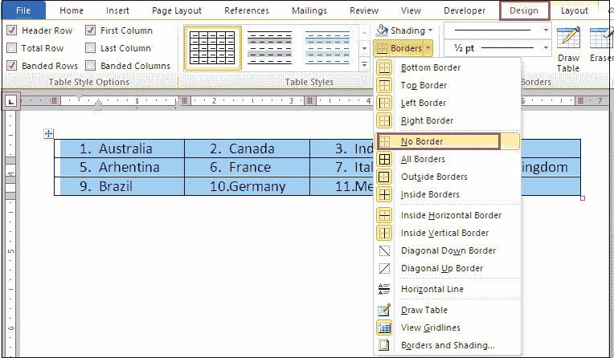

# 如何在 Word 文档中插入项目符号

> 原文：<https://www.javatpoint.com/how-to-insert-bullet-points-in-word-document>

项目符号是一种符号，用于介绍出现在**垂直列表、句子或段落**中的单独项目。它也用于在文档中写入重要信息。

要点的优势在于，可以让读者快速阅读理解**文档的重要部分、重要标题等。**

项目符号包含各种符号，包括**黑点、空心圆、矩形、正方形、菱形、破折号、复选标记、星号、箭头等。**

**示例:**

含有黑点的水果列表-

*   芒果
*   苹果
*   葡萄
*   木瓜

在 Word 文档中插入项目符号有以下几种方法-

### 方法 1:使用主页选项卡

按照下面提到的最简单快捷的步骤插入要点-

**步骤 1:** 打开新的或现有的 [Word](https://www.javatpoint.com/ms-word-tutorial) 文档。

**步骤 2:** 突出显示或选择要插入项目符号的项目列表。

#### 注意:如果列表不是早期创建的，则首先创建一个项目列表。

**第三步:**转到功能区的**主页**选项卡，点击**段落**部分中与**项目符号**关联的**项目符号**下拉图标。

#### 注意:要插入编号，请单击项目符号图标旁边的编号下拉图标。

**第 4 步:**屏幕上将出现最近使用的项目符号列表对话框。选择要插入项目符号库中的项目符号点。

下面的截图显示项目符号被插入到 Word 文档中-

### 方法 2:使用符号选项卡

您也可以使用符号选项卡插入项目符号。符号选项卡包含各种项目符号选项。

按照以下步骤插入要点-

**步骤 1:** 打开新的或现有的 Word 文档。

**第二步:**将光标放在文档中要插入项目符号的位置。

**第三步:**转到功能区的**插入**选项卡，点击**符号**部分中与**符号**图标相关的下拉菜单。点击**更多符号**。

**第 4 步:**屏幕上将出现符号对话框列表。根据您的要求选择一个符号，然后单击屏幕底部的插入按钮。

现在，您可以看到符号(项目符号)被插入到选定的位置。

#### 注意:在文档中插入符号后，可以在“主页”选项卡中使用相同的符号。要访问插入的符号，请转到主页选项卡，然后单击段落部分中的项目符号下拉图标。

#### 方法 3:使用键盘快捷键

这是使用 [MS-Word 键盘快捷键](https://www.javatpoint.com/computer-shortcut-keys#MSWord)插入项目符号点的最简单方法-

按照以下说明使用键盘快捷键插入项目符号-

1.  打开 Word 文档。
2.  将光标放在要插入项目符号的文本前面。
3.  **按住 Alt 键**，在键盘上输入 **Alt 码 0149** 。
4.  从键盘上松开 Alt 键。

现在，您可以看到项目符号点(javaTpoint)被插入到文本之前。

### 方法 4:在 Word 文档中创建多列项目符号列表

按照以下步骤在 Word 文档中创建多列项目符号列表-

**第一步:**打开 Word 文档，输入列表中的项目。

**步骤 2:** 转到功能区的**插入**选项卡，点击**表格部分**中的**表格**选项。

**步骤 3:** 屏幕上将出现一个插入表格对话框。根据您的要求选择行数和列数，或者您也可以单击“插入表格”...选项手动插入行数和列数。

**第 4 步:**表格插入文档后，选择表格，进入**主页**选项卡，点击**段落**部分的**项目符号或编号选项**。

#### 注意:在我们的例子中，我们将使用编号选项。

**步骤 5:** 现在，可以看到编号被插入到表格中。

**第六步:**如果要移除表格的边框，那么选择表格，进入功能区的**设计**选项卡，从下拉菜单中点击**无边框**选项，如下图截图所示。

现在，您可以看到一个多列项目符号列表被插入到 Word 文档中。

* * *