# 如何计算单词中的单词

> 原文：<https://www.javatpoint.com/how-to-count-words-in-word>

现在学校和大学都要求在电脑上打印文章和论文。大多数教育文献篇幅有限，无论是 1000 字还是 80000 字。保持在极限之内是必要的，因为超过临界点会导致后果。此外，写几个好词会让你付出代价。各种各样的人用微软的 Word 打印他们的文档。但并不是每个人都知道 Word 的许多小技巧。在这里，我们讨论如何使用微软 Word 计算文档中的字数。

## 查看我们在微软 Word 中输入的字数

在微软 Word 中，有一个实时单词计数器，当我们在文档中键入单词时，它会计算单词的数量，并允许我们在状态栏中看到它们。为了访问它，我们不需要打开任何菜单或窗口或菜单。

### 输入微软 Word时检查字数的步骤

在我们键入 Microsoft word 时，有以下步骤可以检查字数:

1.首先从开始菜单，我们必须打开

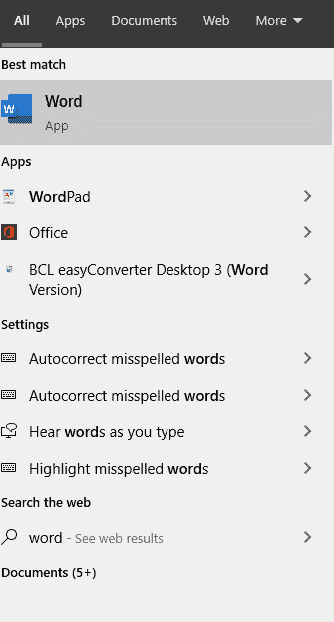

2.为了检查字数，我们可以从新文档开始或者打开已经保存的文档。

3.我们可以在屏幕的左下角看到文档的字数。它显示了我们当前打开的文档中所有页面的总字数。

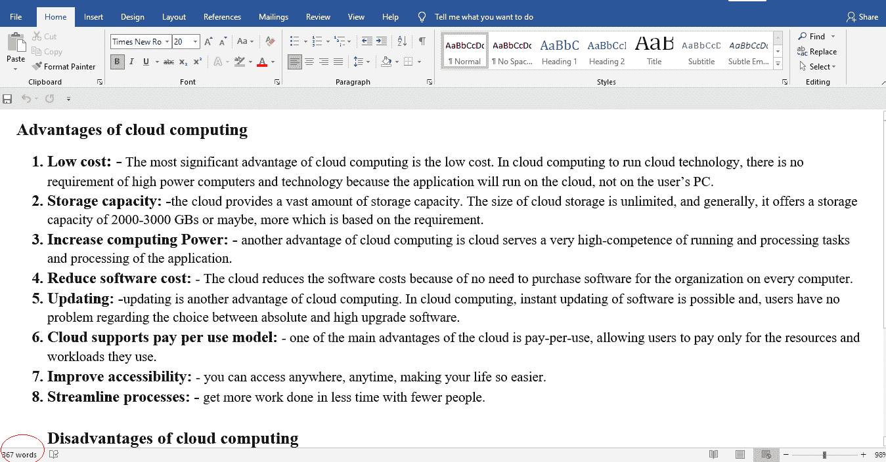

4.如果屏幕左下角没有显示字数，我们就要右键点击屏幕底部的状态栏，然后我们就要选择名为 ***字数*** 的选项。当我们选择单词计数选项时，单词计数器将添加到状态栏中。

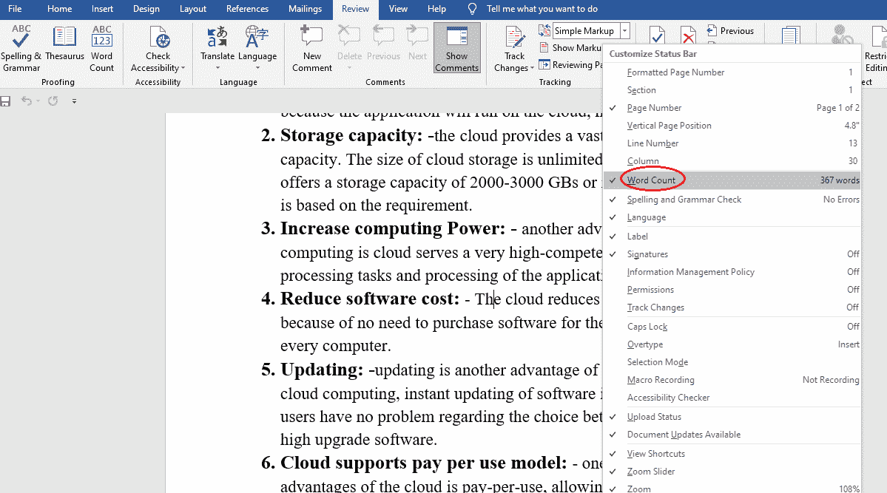

## 查找所选单词的计数

如果我们的文档很大，并且我们想要找到文档中一些选定文本的字数，那么我们必须遵循以下步骤。

1.  首先，我们必须打开要计算字数的 word 文档。
2.  然后，我们必须选择文档中的单词或文本。我们还可以根据需要在文档的任何页面中选择不同的文本块。
3.  现在，我们可以在屏幕底部的状态栏上看到，它会显示 YY 的 XX。这里，XX 表示我们选择的文本的字数，YY 表示我们文档中的总字数。

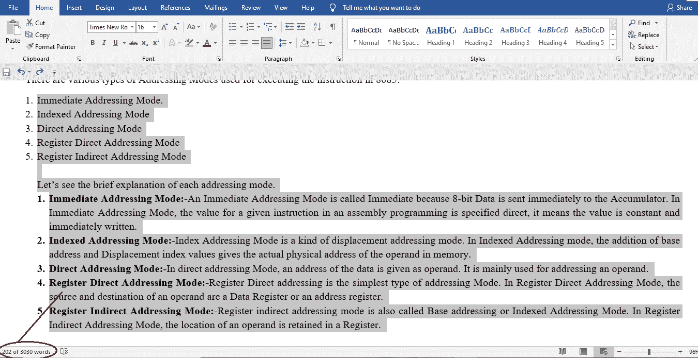

## 查看更多详细信息的字符和字数

状态栏将仅显示受限信息，如字符数和字数。如果我们想看到更多的细节，比如有无空格的字符数，段落数，页数，那么我们就要打开 ***字数框。*T3】**

在我们的计算机上打开 word 中的单词框有以下步骤:

1.首先，我们要打开 ***字***

2.然后，我们必须找到位于屏幕顶部的名为 ***Review、*** 的选项卡，并点击该选项卡。

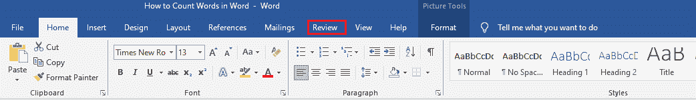

3.找到名为“校对”的部分，在“校对”部分，单击名为 ***字数的选项。*T3】**

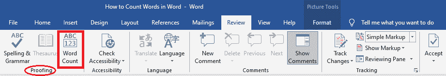

4.然后，在我们的屏幕上，一个小盒子会打开，让你看到文字和其他关于我们的文件的信息。

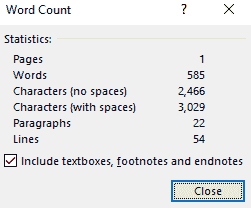

5.如果我们不需要在字数统计中包含文本框、脚注和尾注，我们可以取消它们。

6.然后，如果我们必须结束查看字数，我们必须点击关闭按钮。

## 向文档中添加字数

在 Word 中，我们可以像文档中的字段一样显示字数。Word 允许我们在文档中任何需要的地方显示字数。这个词似乎是一个普通的文本，如果我们想应用我们的格式和风格，我们可以应用它。

向文档中添加字数有以下步骤:

1.首先，我们必须在 Word 中打开文档。

2.接下来，将光标放在我们希望显示字数的地方。

3.然后，点击顶部名为 ***的菜单项，插入*** 。

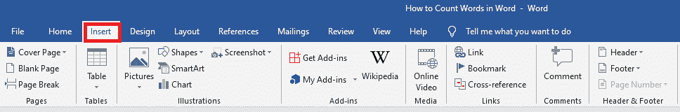

4.现在，在**文本**部分，点击名为 ***快速零件*** 的选项。

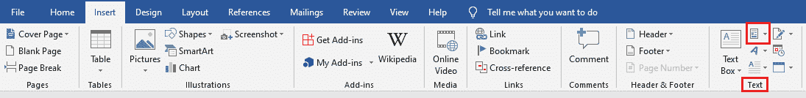

5.从可用选项中，我们必须选择名为“字段”的选项。

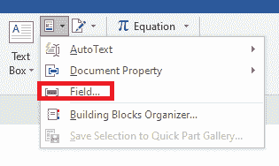

6.然后在左侧，会显示一个字段列表，我们可以将其添加到文档中。选择名为 ***的字段，点击**确定*****

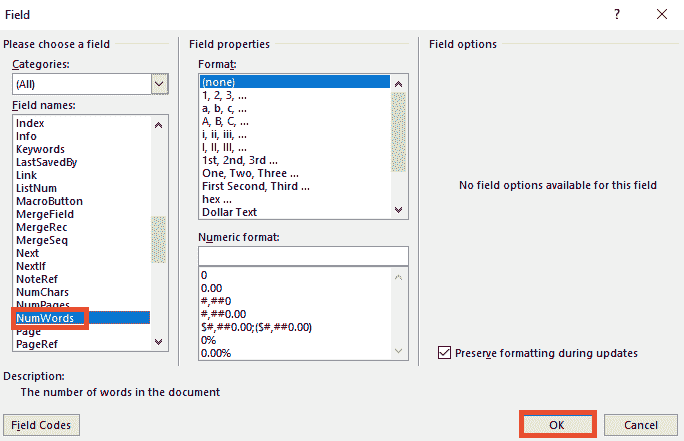

7.现在，在我们的文档中，字数将显示在我们选择的位置。

8.当我们向文档中添加新单词时，我们必须手动更新字数。为此，我们需要右键单击文档中的字数，并选择名为 ***更新字段的字段。*T3】**

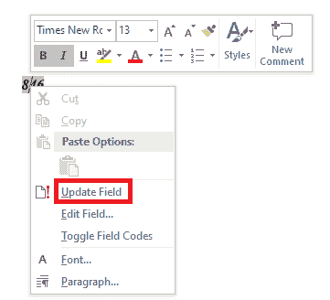

## 在 Microsoft Word 联机中查看字数

在微软 Office 在线版中，还有一个字数统计的功能。我们可以像桌面版一样用同样的方式访问它。

在 Microsoft Word Online 中查看字数有不同的步骤:

1.首先，我们必须登录帐户才能访问办公应用程序。

2.接下来，我们可以编辑现有文档或创建新文档。

3.现在，在顶部菜单栏中，我们需要点击 ***查看***

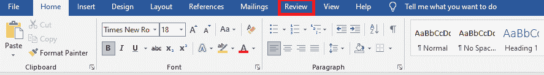

4.然后，为了查看我们当前文档中的总字数，我们必须点击名为 ***字数*** 的选项。

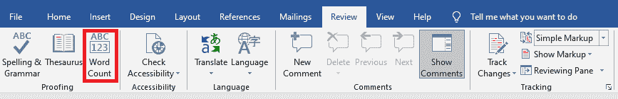

## 在微软在线 Word 的状态栏中添加字数统计

在 Office 在线版中，我们还能够在状态栏中显示实时字数。为此，我们需要在线启用 Word 中的选项。

有以下步骤可以将字数添加到 MS Word Online 的状态栏:

1.首先，我们必须在线打开 Word 中的文档。

2.然后点击位于屏幕顶部的*选项卡。*

*

3.接下来，我们必须点击向下箭头，该箭头出现在名为 ***字数*** 的选项旁边。

4.然后勾选**显示字数**选项。

5.现在，在状态栏中，我们可以看到字数，它位于屏幕底部。

## 禁用和启用字数统计

我们可以在 word 中禁用和启用字数统计选项。

禁用和启用字数统计有不同的步骤:

1.如果要禁用字数统计选项，需要右键点击状态栏，然后取消勾选 ***字数统计选项。*T3】**

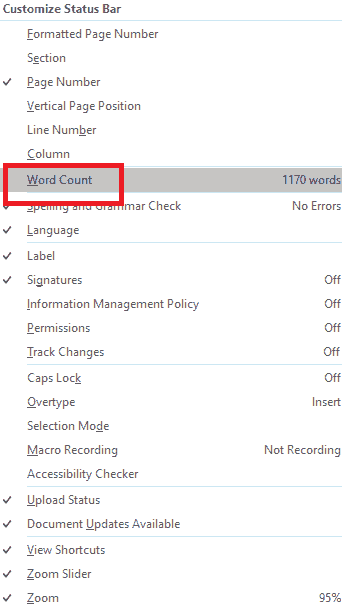

2.如果你想启用 ***字数统计*** 选项，那么你必须再次勾选 ***字数统计*** 选项。

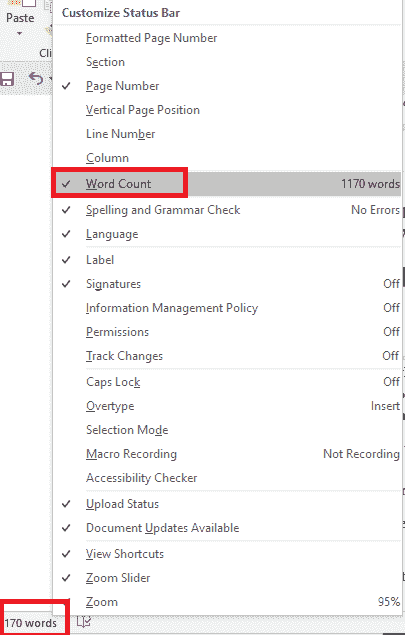

* * **