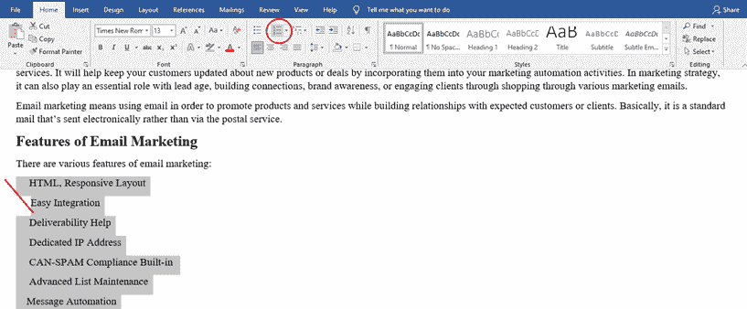
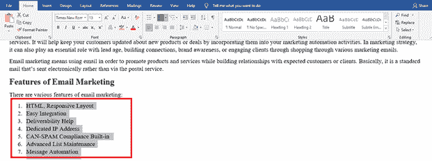
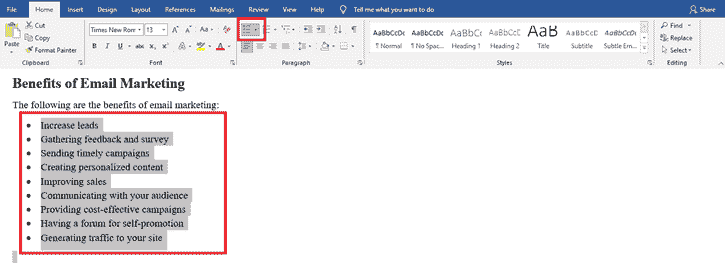
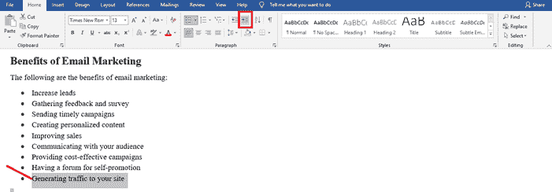
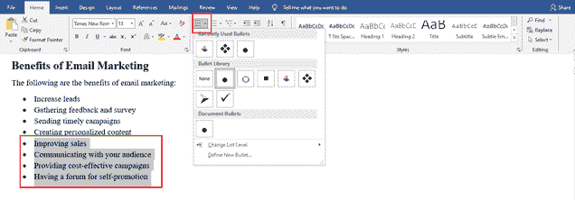
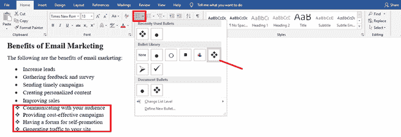
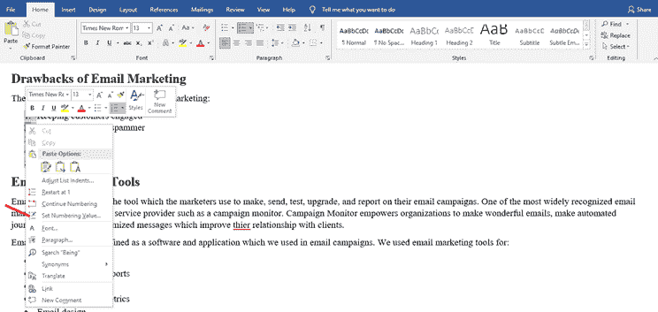
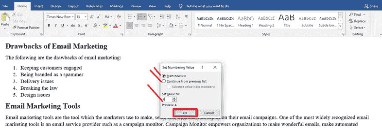

# 如何突出重点

> 原文：<https://www.javatpoint.com/how-to-make-a-bullet-point>

## 什么是要点？

在印刷术中，项目符号指的是印刷符号或字形，我们用它来介绍列表中的项目。例如:

*   第一点
*   第二点
*   第三点
*   第 4 点
*   第五点

项目符号可以有几种不同的形式，包括圆形、箭头形、菱形和方形。典型的文字处理器软件有大量的形状和颜色可供选择。像-(连字符)、*(星号)甚至 O(小写拉丁字母 O)这样的各种标准符号通常用于纯 ASCII 文本或其他没有项目符号的上下文中。我们通过项目符号制作的列表称为项目符号列表。

我们用要点列出内容中的项目。他们通过吸引倾向于浏览我们内容的读者的兴趣来帮助我们成功地传达信息。看看...扫描仪痴迷于子弹点不是真的吗？

## 如何制定有效的要点

根据文案博主的说法，“伟大子弹的本质是简洁+承诺。”我们表明，我们知道如何通过使用项目符号来简明扼要。然后，我们应该贯彻这一承诺，使每一点都至关重要。

让我们展示要点的力量，以及一系列写有效要点的技巧:

**1。保持简单**

尽量使要点简单，避免复杂的轮廓，不要使用子项目符号。

**2。将要点视为迷你标题**

子弹必须简明扼要，引人注目，以激起读者的兴趣，迫使他们阅读更多。

**3。保持项目符号主题相关**

为了说明非常特殊的主题的基本要素，通过使用要点来保持一个轨道。

**4。不要过度**

不要过度使用子弹，因为我们希望我们的帖子看起来像一篇文章，而不是一个杂货清单

**5。确保项目符号点对称**

所有要点都必须以粗体指令开始，以一句话的描述结束。

**6。突出重要元素以理解文章内容**

这里没有太多的绒毛空间，所以强调最重要的几点。

## 使用要点的语法基础

要点也会让作者感到困惑。你在每一个前面放大写字母吗？你能在句末使用句号吗？什么时候用数字代替子弹？事实证明，为了通过要点使帖子更容易阅读，要点的战略性使用需要一些练习。

以下是我们在使用要点时必须牢记的一些要点:

**1。数字还是子弹？**

如果动作项目必须严格按顺序完成，请使用编号列表代替项目符号。

**2。带项目符号的标点符号**

如果要点是一个完整的句子或几个句子，请使用大写字母和标点符号。如果你的要点没有排列成完整的句子，就没有必要使用标点符号。大写是一种风格选择，句子片段可能以大写字母或小写字母开头。

**3。引言句**

如果是一个完整的句子，呈现我们列表的文本必须以冒号结尾。如果文本是一个片段，那么跳过冒号，直接进入列表。

**4。用于项目符号的结构**

使用不同的句子结构不是一个好主意。你的所有观点，无论是句子还是片段，都应该是一致的。通过开头，每个要点与讲话的同一部分，确保你的要点的语法结构是平行的。例如，如果你以一个形容词开始一个点，你应该以一个形容词开始你所有的点。

## 要点的最佳实践

冗长段落中的长句已经成为过去。我们的读者希望快速检索信息。在项目符号列表中排列信息是帮助他们完成这项工作的好方法。

这里有一些让要点清晰明了的小技巧。要列出功能、提示和步骤，请使用项目符号，如下表所示。

**1。使要点一致**

使项目符号的排列保持一致。例如，造出所有的句子、问题或片段。虽然如果有两套要点，也没有必要让它们相互兼容，只是在它们自身之内。

**2。避免在项目符号末尾使用分号。**

虽然分号过去曾以这种方式使用过，但现在这种样式在今天的简明文档中似乎已经更新了。注意:分号是这样出现的:；

**3。应避免过渡词和短语**

不要使用过渡词和短语，例如“另一点”或“其次”这些连接短语不是必需的，会让读者慢下来。

**4。确保要点相关**

如果我们有很多要点，请确保所有要点都是相互关联的。如果我们有很多，那么我们可能需要两套而不是一套。例如，如果我们的项目由优势和机会组成，那么将它们分成两个列表，一个被认为是优势，另一个被认为是机会。

**5。清晰地布置要点**

避免使用多种字体或边距。

**6。如果我们有很多要点，请给要点编号**

假设我们有很多要点，比如 5 个以上，然后给它们编号。这样，我们的读者将能够轻松地监控和参考子弹。

**7。不断给项目符号加标点符号**

根据以下规则，如果一个项目符号以句号(句号)结尾，则所有项目符号都应以句号结尾:

*   如果所有的项目符号都是片段或短语，那么就不需要使用结尾标点。
*   如果所有的项目符号都是句子，那么我们必须用句号或句号来结束每一个项目符号。

**8。当我们想要建立融洽的关系时，避开要点**

如果我们试图建立融洽的关系或处理一个敏感的话题，避免使用要点。子弹不是传递温暖，而是表达品质。

**9。避免将要点写得太长**

确保要点不要太长，看起来像段落。合理的最大长度是三行。

## 如何在 Word 中插入项目符号

如果要在文档中添加项目列表，我们可以将其格式化为编号列表或项目符号列表。当我们向列表中添加一个新项目时，序号或项目符号会自动添加到它的前面。

### 编号列表

编号列表中的每一行都将按顺序编号。这对于按正确的顺序列出应该遵循的步骤非常有用。

我们需要在编号列表中遵循以下步骤:

1.  选择将用于创建编号列表的文本。
2.  然后，我们必须点击编号按钮。

当我们点击数字列表时，我们选择的文本变成了数字列表。

列表格式可以通过再次单击编号按钮来删除列表。

### 项目符号列表

如果项目的顺序无关紧要，我们就使用项目符号列表，例如制作购物清单。

以下步骤用于项目符号列表:

1.  首先，我们必须选择需要用来创建编号列表的文本。
2.  单击项目符号按钮。

现在，我们可以在上面的图像中看到，所选项目被格式化为项目符号列表。就像我们在编号列表中做的那样，再次点击项目符号按钮，然后列表将关闭列表格式。

### 多级列表

项目符号列表和编号列表都可能有许多级别，允许我们创建主题和子主题的大纲。通过降级列表项，任何列表都可以转换为多级列表。

多级列表中使用了以下步骤:

1.  首先，我们必须选择要降级的列表项。
2.  然后点击名为 ***的图标增加缩进*** 。

现在我们可以在上面的图片中看到列表项目是缩进的，根据列表的样式，数字或项目符号可能会改变。

我们可以多次缩进一个列表项，以便增加层次。要将列表项返回到更高级别，我们需要单击“减少缩进”按钮。

### 更改列表样式

虽然项目符号列表和编号列表都有默认样式，但是我们可以修改列表的编号样式和项目符号样式。

更改列表样式的步骤如下:

1.首先，我们需要选择想要更改的列表。

我们也可以只选择一个列表项，以便只修改该列表项的样式。

2.单击编号按钮列表箭头或项目符号按钮列表箭头。

3.基于我们使用的列表样式；我们可以为项目符号选择新的符号和不同的编号样式，如罗马数字。

4.选择新的列表样式

现在，我们可以在上面的图片中看到样式被更新了。

### 自定义编号

编号列表会自动按顺序对列表中的每一项进行编号，但如果我们愿意，也可以对其进行更改。

以下是我们用于自定义编号的步骤:

1.首先，我们必须右键单击一个列表编号。

2.然后，我们需要选择设置编号值选项。

3.做出我们的调整。

*   **开始新列表:** -默认，从“1”开始我们的列表
*   **从上一个列表继续:** -从上一个编号列表的末尾开始编号。如果我们检查预付值，我们可以跳过数字。
*   **设置值为:** -它允许我们输入“1”以外的数字来开始我们的列表。
*   完成后点击**确定**按钮。

* * *