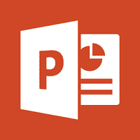

# 微软幻灯片教程

> 原文:[https://www.javatpoint.com/powerpoint-tutorial](https://www.javatpoint.com/powerpoint-tutorial)

MS PowerPoint 教程提供了 PowerPoint 的基本概念和高级概念。我们的 PowerPoint 教程是为初学者和专业人士设计的。

微软 PowerPoint 是微软编写的计算机应用程序。主要用于演示设计。

我们的微软幻灯片教程包括微软幻灯片的所有主题，如访问工具栏、迷你工具栏、主题、幻灯片、占位符、保存演示文稿、更改主题背景、插入图片、编辑图片、表格格式、插入图表、动画效果等。

* * *

## 微软幻灯片索引

* * *

**MS PowerPoint 教程**

*   [PowerPoint 教程](powerpoint-tutorial)
*   [什么是 PowerPoint](what-is-powerpoint)
*   [微软办公按钮](powerpoint-microsoft-office-button)
*   [快速访问工具栏](powerpoint-quick-access-toolbar)
*   [色带和标签](powerpoint-ribbon-and-tabs)
*   [标签的特性](powerpoint-features-of-the-tabs)
*   [幻灯片、占位符、注释](powerpoint-slide-placeholder-and-notes)
*   [迷你工具栏](powerpoint-mini-toolbar)

**演示基础知识**

*   [创建演示文稿](creating-a-presentation-powerpoint)
*   [保存演示文稿](how-to-save-a-presentation-powerpoint)
*   [添加幻灯片](how-to-add-slide-powerpoint)
*   [如何应用主题](how-to-apply-themes-powerpoint)
*   [改变主题颜色](how-to-apply-or-change-color-in-themes-powerpoint)
*   [主题背景](how-to-change-the-background-of-a-theme-powerpoint)

**文字基础**

*   [删除文字](how-to-delete-text-powerpoint)
*   [格式字号](how-to-format-font-size-powerpoint)
*   [格式字体风格](how-to-format-font-style-powerpoint)
*   [格式化文本颜色](how-to-format-text-color-powerpoint)
*   [更改文本对齐方式](how-to-change-text-alignment-powerpoint)
*   [插入文本框](how-to-insert-a-textbox-powerpoint)
*   [复制粘贴文本](how-to-copy-and-paste-text-powerpoint)
*   [如何剪切粘贴文本](how-to-cut-and-paste-text-powerpoint)

**插入图片**

*   [插入图片和剪贴画](how-to-insert-picture-and-clip-art-powerpoint)
*   [编辑图片和剪贴画](how-to-edit-picture-and-clip-art-powerpoint)
*   [编号列表](how-to-create-bulleted-or-numbered-lists-powerpoint)

**处理表格**

*   [插入表格](how-to-insert-table-powerpoint)
*   [格式表](how-to-modify-or-format-table-powerpoint)
*   [Word 或 Excel](how-to-insert-table-from-word-or-excel-powerpoint)

**使用图表**

*   [插入图表](how-to-insert-chart-powerpoint)
*   [如何输入图表数据](how-to-enter-chart-data-powerpoint)
*   [图表数据](how-to-format-chart-or-chart-data-powerpoint)

**滑动效果**

*   [动画效果](how-to-apply-animation-effect-powerpoint)
*   [自定义动画效果](how-to-apply-a-custom-animation-effect-powerpoint)
*   [滑动过渡效果](how-to-apply-slide-transition-effects-powerpoint)
*   [设置幻灯片过渡声音](how-to-set-slide-transition-sound-powerpoint)
*   [设定滑动过渡速度](how-to-set-slide-transition-speed-powerpoint)
*   [如何推进幻灯片](how-to-advance-slides-powerpoint)
*   [查看幻灯片](powerpoint-viewing-slides)

* * *

## 先决条件

在学习微软 PowerPoint 之前，你必须具备计算机基础的基础知识。

## 观众

我们的微软幻灯片教程旨在帮助初学者和专业人士。

## 问题

我们保证您在这篇微软幻灯片教程中不会发现任何问题。但是如果有任何错误，请在联系表格中发布问题。