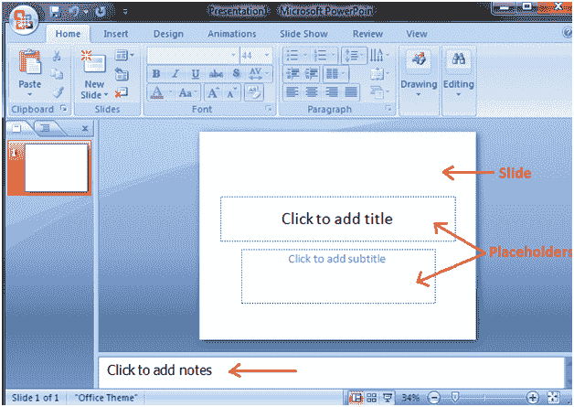

# 幻灯片、占位符和注释

> 原文：<https://www.javatpoint.com/powerpoint-slide-placeholder-and-notes>

**幻灯片:**演示文稿是在幻灯片上创建的。它位于幻灯片窗口的中心。

**占位符:**默认情况下，当您打开 PowerPoint 时，幻灯片中会出现两个占位符。

**点击添加备注:**此空间用于在需要时创建备注。

见图:

