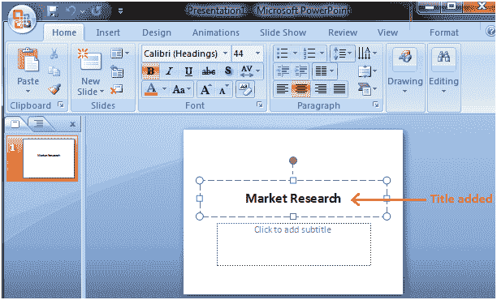
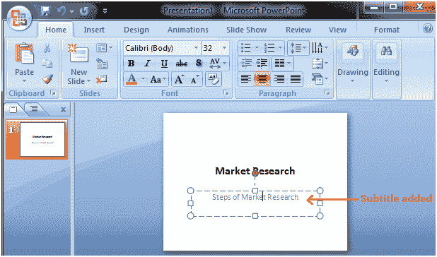
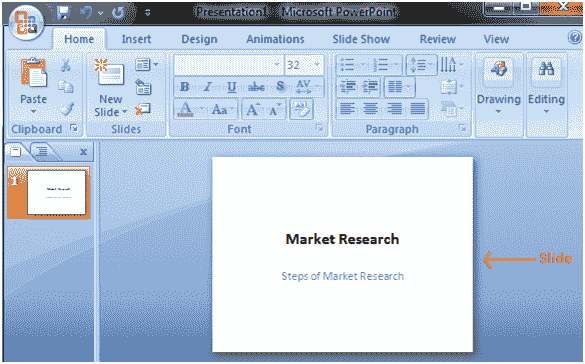

# 创建演示文稿

> 原文:[https://www . javatpoint . com/creating-a-presentation-PowerPoint](https://www.javatpoint.com/creating-a-presentation-powerpoint)

默认情况下，当您打开 PowerPoint 窗口时，会出现一张幻灯片。幻灯片有两个占位符或文本框。可以从“插入”选项卡添加其他文本框。

要开始创建演示文稿，请单击占位符或文本框，会出现一个闪烁的光标。然后键入标题并在框外单击。文本框将消失。

见图。

类似地，在另一个文本框中添加文本或字幕。

见图:

单击文本框外部，幻灯片将如下图所示:

