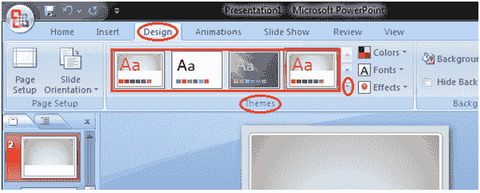

# 如何应用主题

> 原文:[https://www.javatpoint.com/how-to-apply-themes-powerpoint](https://www.javatpoint.com/how-to-apply-themes-powerpoint)

主题是设计模板，使展示丰富多彩，造型师。只需单击一下，您就可以将主题应用于整个演示文稿。

*   打开“设计”选项卡
*   找到主题组
*   单击所需的主题
*   主题将被添加到整个演示文稿中

要查看所有可用的主题，请单击主题组右下角的下拉箭头。

