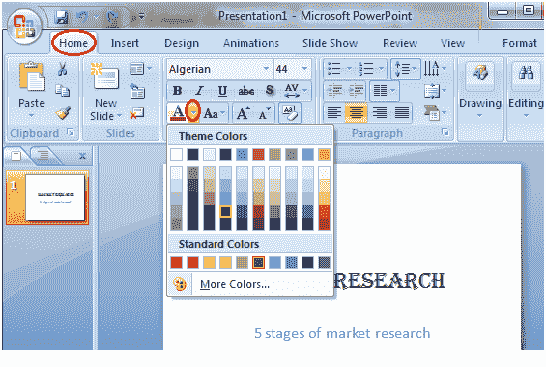

# 如何格式化文本颜色

> 原文:[https://www . javatpoint . com/how-format-text-color-PowerPoint](https://www.javatpoint.com/how-to-format-text-color-powerpoint)

*   选择要更改的文本
*   在“主页”选项卡中，找到“字体”组
*   在字体组中，单击字体颜色图标旁边的下拉箭头
*   出现字体颜色菜单
*   选择所需的字体颜色

**见图:**

