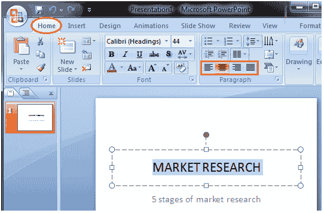

# 如何更改文本对齐方式

> 原文:[https://www . javatpoint . com/how-change-text-alignment-PowerPoint](https://www.javatpoint.com/how-to-change-text-alignment-powerpoint)

*   选择文本
*   在“主页”选项卡中，找到“段落”组
*   段落组底部有四个对齐选项
*   选择所需的对齐选项

四个对齐选项是:

*   **向左对齐文本:**向左对齐文本
*   **居中:**使文本居中
*   **向右对齐文本:**向右对齐文本
*   **对齐:**将文本左右对齐

**见图:**

