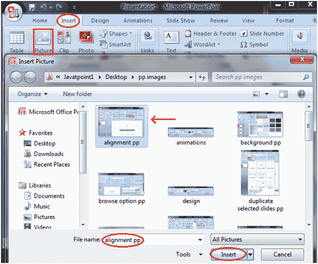
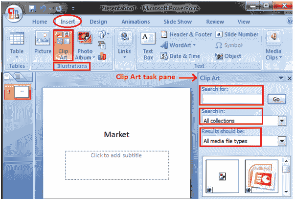
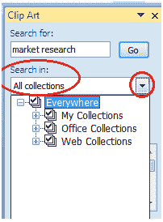
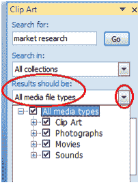
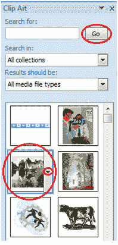

# 如何插入图片和剪贴画

> 原文：<https://www.javatpoint.com/how-to-insert-picture-and-clip-art-powerpoint>

**添加图片:**

*   单击插入选项卡
*   在插图组中，单击图片按钮
*   出现“插入图片”对话框
*   点击选择所需的图片
*   单击插入，图片将被添加到幻灯片中
*   单击并拖动图片，将其移动到所需位置

**见图:**

**添加图片:**

*   单击插入选项卡
*   在“插图”组中，单击“剪贴画”按钮
*   “剪贴画”任务窗格出现在右侧
*   在任务窗格中，您将注意到三个字段:搜索、搜索范围、结果应该是

**见图:**

在“搜索栏”中，您可以输入与要插入的剪贴画相关的关键词

在“收集字段”中，单击下拉箭头。它给出了四个选项。选择适合您要求的选项。

**见图:**

在“结果应”字段中单击下拉箭头，您会发现五个选项。选择适合您要求的选项。

**见图:**

现在点击“开始”。将出现“剪贴画”菜单。选择所需的剪贴画或单击剪贴画旁边的下拉箭头，它将显示“插入”选项来添加剪贴画

