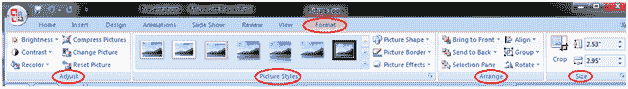
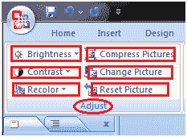
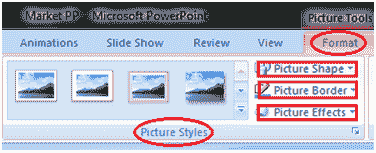
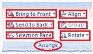
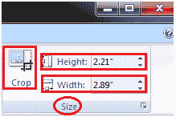

# 如何编辑图片和剪贴画

> 原文：<https://www.javatpoint.com/how-to-edit-picture-and-clip-art-powerpoint>

*   选择要编辑的图片或剪贴画
*   “格式”选项卡出现在“视图”选项卡旁边的功能区中
*   它显示四组命令；调整、图片样式、排列和大小组

**见图:**

“调整”组显示六个命令。

**见图:**

*   **亮度:**增加和降低画面亮度
*   **画面对比度:**增加或减少画面对比度
*   **重新着色:**给图片重新着色以赋予其特殊效果
*   **压缩图片:**压缩图片缩小图片
*   **换图:**换图
*   **重置图片:**放弃对图片的所有更改

“图片样式”组显示图片样式和三个命令。

**见图:**

*   **图片样式:**将图片样式应用于图片或剪贴画
*   **图片形状:**更改图片或剪贴画的形状
*   **图片边框:**为图片边框赋予颜色
*   **图片效果:**将视觉效果应用于图片

编配组有六个命令:

**见图:**

*   **带到前面:**将图片带到所有其他对象的前面
*   **发送回:**将图片发送到其他对象后面
*   **选择窗格:**显示选择窗格，有各种选项可以格式化和改变图片顺序
*   **对齐:**对齐幻灯片上的多张图片。您可以将它们均匀地分布在幻灯片上。
*   **分组:**将不同的对象分组在一起
*   **旋转:**旋转文本或对象

“大小”组有三个命令。

**见图:**

*   **裁剪:**去除图片中不需要的部分
*   **高度:**改变图片高度
*   **宽度:**改变图片宽度