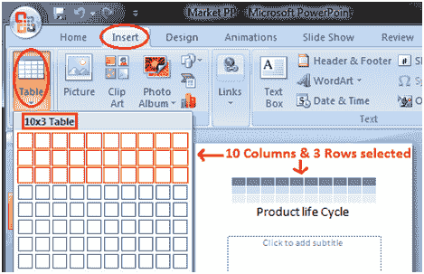
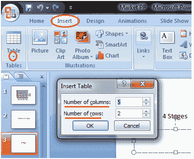
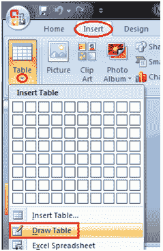
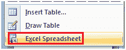

# 如何插入表格

> 原文:[https://www.javatpoint.com/how-to-insert-table-powerpoint](https://www.javatpoint.com/how-to-insert-table-powerpoint)

*   将光标放在幻灯片上要插入表格的位置
*   单击插入选项卡，它将在左侧显示表格组
*   点击表格按钮，它将显示四个选项来插入表格:

1)突出显示行数和列数

您将在顶部看到小框，选择与表格中所需的行数和列数相对应的框。

**见图:**

2)插入表格

单击插入表格选项，输入行数和列数，然后单击确定。

**见图:**

3)绘制表格:

单击“绘制表格”选项，并将光标放在幻灯片上。光标变成铅笔。单击并拖动铅笔绘制表格边框。

**见图:**

4)电子表格:

单击 Excel 电子表格选项。工作表将出现在幻灯片中，拖动它以获得所需的行数和列数。

**见图:**

