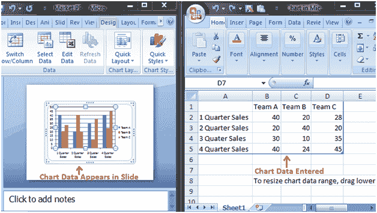

# 如何输入图表数据

> 原文：<https://www.javatpoint.com/how-to-enter-chart-data-powerpoint>

我们不能直接在图表中输入数据。要在图表中输入数据，我们必须在 excel 电子表格中键入数据，当您添加图表或单击编辑图表选项时，就会出现该电子表格。

您在电子表格中输入的数据会自动出现在图表中。选择电子表格的单元格，并键入它将出现在幻灯片中的数据。重复该过程以输入全部数据。

**见图:**

