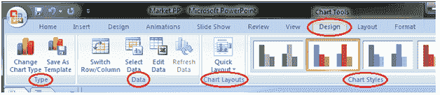
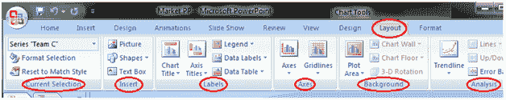
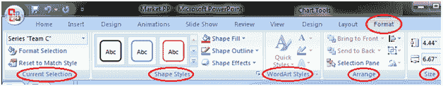

# 如何格式化图表或图表数据

> 原文:[https://www . javatpoint . com/如何格式化图表或图表数据-powerpoint](https://www.javatpoint.com/how-to-format-chart-or-chart-data-powerpoint)

当您选择图表时，三个新的选项卡“设计”、“布局”和“格式”会出现在功能区中。每个选项卡都包含特定的图表工具组，用于格式化图表和图表数据。

“设计”选项卡包含四个组；类型、数据、图表布局和图表样式。

**见图:**

“布局”选项卡包含六个组；当前选择、插入、标签、轴、背景和分析。

**见图:**

“格式”选项卡包含五个组；当前选择、形状样式、艺术字样式、排列和大小。

**见图:**

