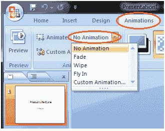

# 如何应用动画效果

> 原文：<https://www.javatpoint.com/how-to-apply-animation-effect-powerpoint>

*   选择要制作动画的文本或对象
*   选择动画选项卡
*   在动画组中，单击动画选项旁边的下拉箭头
*   将出现动画选项
*   将光标移到不同的选项上，查看幻灯片上的实时预览
*   选择所需的动画

**见图:**

