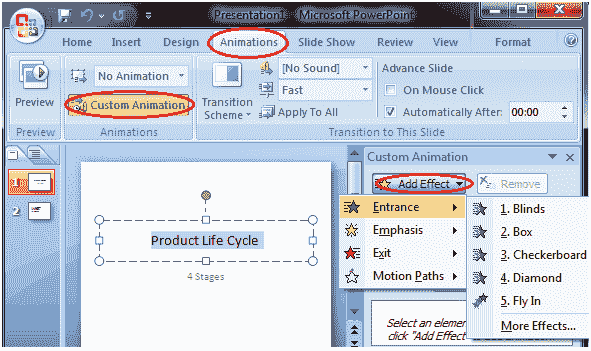

# 如何应用自定义动画效果

> 原文：<https://www.javatpoint.com/how-to-apply-a-custom-animation-effect-powerpoint>

*   选择文本或对象
*   选择“动画”选项卡
*   在“动画”组中，单击自定义动画
*   “自定义动画”任务窗格出现在右侧
*   点击添加效果，它将显示四个选项，进一步分为不同的选项
*   选择所需的效果

**见图:**

