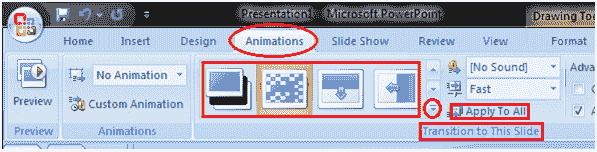

# 如何应用幻灯片过渡效果

> 原文:[https://www . javatpoint . com/如何应用-幻灯片-过渡-效果-powerpoint](https://www.javatpoint.com/how-to-apply-slide-transition-effects-powerpoint)

当幻灯片放映中的一张幻灯片切换到下一张幻灯片时，会出现过渡效果。

*   选择要应用效果的幻灯片
*   选择“动画”选项卡
*   在“过渡到此幻灯片”组中，您将看到过渡效果
*   单击下拉箭头查看过渡效果菜单
*   选择所需的过渡效果
*   单击“全部应用”将效果应用于所有幻灯片

**见图:**

