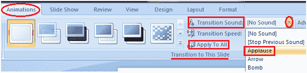

# 如何设置幻灯片切换声音

> 原文:[https://www . javatpoint . com/如何设置-幻灯片-过渡-声音-powerpoint](https://www.javatpoint.com/how-to-set-slide-transition-sound-powerpoint)

*   选择要添加转场声音的幻灯片
*   选择“动画”选项卡
*   在“过渡到此幻灯片”组中，单击“过渡声音”选项旁边的下拉箭头
*   将出现不同过渡声音的列表
*   选择所需的过渡声音
*   单击“全部应用”将效果应用于所有幻灯片

**见图:**

